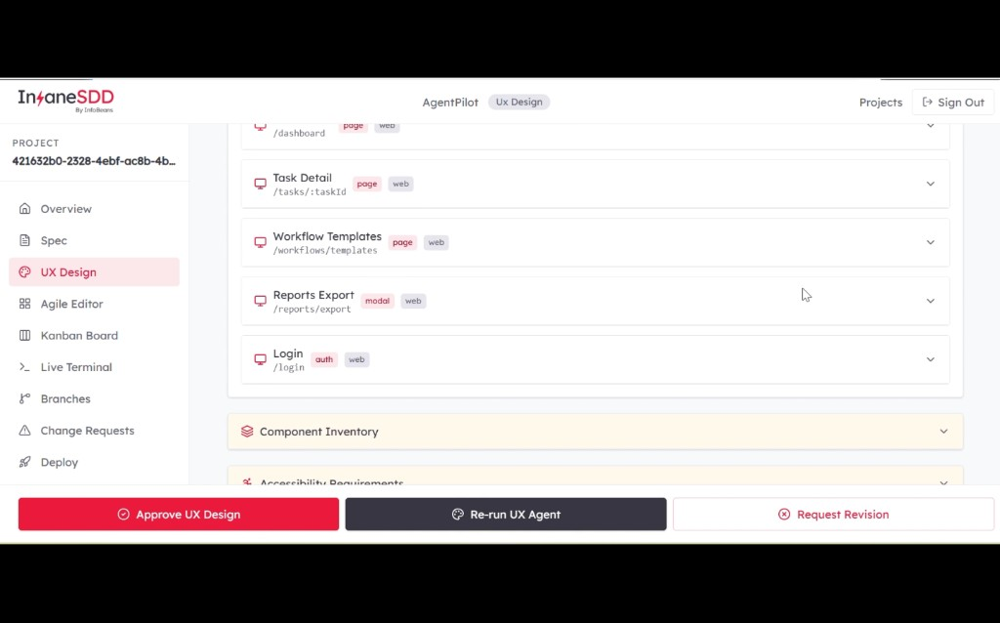
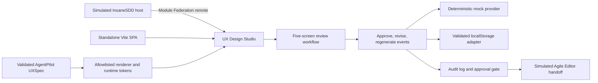

# UX Design Studio

An independent proof-of-work concept extension for InsaneSDD 2.0. It is **not** an official InfoBeans product or feature, and it is not a production system.

## Why this demo?

- This demo shows lead ability to own the full frontend lifecycle: requirements, architecture, implementation, testing, deployment, and presentation.
- It is a practical way to showcase React, TypeScript, micro-frontend, accessibility, performance, and enterprise workflow experience.
- More than showing screens, it demonstrates how I make engineering decisions, define boundaries, manage risk, and build something that can integrate with a larger SaaS platform.
- This is an independent proof-of-work created specifically to demonstrate engineering and product-thinking capabilities.

## What this is about

- Inspired by InsaneSDD, this POC explores how its UX design stage could become more visual and interactive.
- It turns a structured UX specification into responsive screen previews that reviewers can inspect, revise, regenerate, and approve.
- It also shows how the module can run on its own or integrate into a React host using Module Federation.

<p align="center">
  
</p>

### Architecture at a glance

Two entry paths reach the same React app: a standalone Vite SPA, and a simulated InsaneSDD host that loads the studio through Module Federation. A validated AgentPilot UXSpec drives an allowlisted renderer and runtime `--uxds-*` tokens. Reviewers approve, revise, or regenerate screens; those actions append governance events. Regeneration uses a deterministic mock provider. State rehydrates through a validated localStorage adapter. Selectors derive the audit log and approval gate. In federated mode, gate completion updates the host and opens a simulated Agile Editor — not a real Agile plan, backend, LLM, or authentication flow.



### Layering

The studio keeps clear boundaries so UI, domain rules, adapters, and host integration stay separate:

```text
src/app            bootstrap, routes, providers, feature flags
src/features       overview, review, governance UI, audit, lenses, overlays
src/application    command orchestration (approve, revise, regenerate)
src/domain         UXSpec model + governance rules (framework-free)
src/ports          persistence, provider, clock, ID contracts
src/infrastructure seed data, browser persistence, mock design-agent provider
src/renderer       allowlisted registry, recursive composer, theming, actions
src/ui             shared shell and presentation primitives
src/integration    host contract mount boundary and gate-event handoff
```

## Best practices showcase (senior frontend checklist)

Interview-oriented checklist of practices that are **practically implemented** in this repository. Each item links to evidence so claims can be verified in code or docs. A short honest "deliberately not used" list follows.

### Engineering and delivery process

- [x] Agile plan with epics, stories, tasks, stable keys, DoR/DoD, and WIP limit 1 — [`docs/UX_Design_Studio_Development_Plan_v1.0.md`](docs/UX_Design_Studio_Development_Plan_v1.0.md), [`.github/import/development-plan.json`](.github/import/development-plan.json)
- [x] GitHub Projects plan validation and import automation — [`scripts/import-github-project.ts`](scripts/import-github-project.ts)
- [x] Branching convention `<type>/uxds-<issue>-<slug>`, `staging` / `main` flow, merge commits, retained feature branches — [`AGENTS.md`](AGENTS.md)
- [x] Conventional Commits with signed commits and fail-closed CI signature verification — [`scripts/ci/verify-commit-signatures.ts`](scripts/ci/verify-commit-signatures.ts)
- [x] Pull request template with summary, acceptance criteria, and verification table — [`.github/pull_request_template.md`](.github/pull_request_template.md)
- [x] CI quality gate: lint, typecheck, unit tests, build, Playwright e2e, signature check; SHA-pinned Actions; concurrency cancellation — [`.github/workflows/quality.yml`](.github/workflows/quality.yml)
- [x] ADRs, PRD → architecture → issue → code → test traceability, release acceptance gates, release notes, tag `v0.1.0-poc` — [`docs/architecture-decisions.md`](docs/architecture-decisions.md), [`docs/traceability.md`](docs/traceability.md), [`docs/release-acceptance.md`](docs/release-acceptance.md), [`docs/release-notes-v0.1.0-poc.md`](docs/release-notes-v0.1.0-poc.md)
- [x] Agent-governed delivery: run manifests, independent read-only verifier, CI-validated agent-control files — [`.agents/`](.agents), [`.agents/skills/uxds-story-loop/SKILL.md`](.agents/skills/uxds-story-loop/SKILL.md), [`.agents/verifiers/uxds-story-verifier.md`](.agents/verifiers/uxds-story-verifier.md), [`scripts/agent/validate-agent-control.ts`](scripts/agent/validate-agent-control.ts)
- [x] Static SPA deploy config with deep-link rewrites (Vercel) — [`apps/ux-design-studio/vercel.json`](apps/ux-design-studio/vercel.json)
- [x] Branch protection / required checks documented for GitHub settings (rulesets live on the remote, not in-repo) — [`AGENTS.md`](AGENTS.md)

### Architecture

- [x] Hexagonal (ports and adapters) layering: `domain` / `application` / `ports` / `infrastructure` / `renderer` / `features` / `ui` / `integration` — [`apps/ux-design-studio/src/`](apps/ux-design-studio/src/)
- [x] Framework-free domain (purity asserted by test; injected clock and ID generation) — [`apps/ux-design-studio/src/domain/governance/governance.test.ts`](apps/ux-design-studio/src/domain/governance/governance.test.ts)
- [x] Micro-frontend via route-level Module Federation (`@module-federation/vite`): remote exposes `./App`, host consumes it; React, React DOM, and React Router shared as singletons — [`apps/ux-design-studio/module-federation.config.ts`](apps/ux-design-studio/module-federation.config.ts), [`apps/insanesdd-host/module-federation.config.ts`](apps/insanesdd-host/module-federation.config.ts)
- [x] Graceful remote failure: host error boundary, retry, and e2e proof — [`apps/insanesdd-host/src/federation/RemoteErrorBoundary.tsx`](apps/insanesdd-host/src/federation/RemoteErrorBoundary.tsx), [`e2e/federation/remote-failure.spec.ts`](e2e/federation/remote-failure.spec.ts)
- [x] Zod-validated host ↔ remote contract package — [`packages/uxds-host-contract/src/parse-contract.ts`](packages/uxds-host-contract/src/parse-contract.ts)
- [x] pnpm monorepo workspace (`apps/*`, `packages/*`) — [`pnpm-workspace.yaml`](pnpm-workspace.yaml)
- [x] Feature flags for independently removable optional modules — [`apps/ux-design-studio/src/app/config.ts`](apps/ux-design-studio/src/app/config.ts)

### Frontend (React) patterns

- [x] Hooks in production use: `useState`, `useMemo`, `useCallback`, `useContext`, `useRef`, `useId`, `useEffect` with cleanup, and custom hooks (`useGovernance`, `useStudioRouting`, `useGateEvents`) — [`apps/ux-design-studio/src/features/governance/GovernanceProvider.tsx`](apps/ux-design-studio/src/features/governance/GovernanceProvider.tsx), [`apps/ux-design-studio/src/features/governance/governance-context.ts`](apps/ux-design-studio/src/features/governance/governance-context.ts), [`apps/ux-design-studio/src/app/studio-routing.tsx`](apps/ux-design-studio/src/app/studio-routing.tsx), [`apps/ux-design-studio/src/integration/use-gate-events.ts`](apps/ux-design-studio/src/integration/use-gate-events.ts)
- [x] `AbortController` for cancellable async regeneration through a provider port — [`apps/ux-design-studio/src/features/governance/GovernanceProvider.tsx`](apps/ux-design-studio/src/features/governance/GovernanceProvider.tsx)
- [x] Error boundaries at three levels: route, per-render-node, and federated remote — [`apps/ux-design-studio/src/app/error-boundary.tsx`](apps/ux-design-studio/src/app/error-boundary.tsx), [`apps/ux-design-studio/src/renderer/composer/NodeErrorBoundary.tsx`](apps/ux-design-studio/src/renderer/composer/NodeErrorBoundary.tsx), [`apps/insanesdd-host/src/federation/RemoteErrorBoundary.tsx`](apps/insanesdd-host/src/federation/RemoteErrorBoundary.tsx)
- [x] `React.lazy` + `Suspense` for the federated remote — [`apps/insanesdd-host/src/federation/FederatedUxDesignStudio.tsx`](apps/insanesdd-host/src/federation/FederatedUxDesignStudio.tsx)
- [x] Event-sourced state: pure reducer, append-only events, derived selectors (single source of truth), deep-frozen spec and tokens — [`apps/ux-design-studio/src/domain/governance/governance-reducer.ts`](apps/ux-design-studio/src/domain/governance/governance-reducer.ts), [`apps/ux-design-studio/src/domain/governance/selectors.ts`](apps/ux-design-studio/src/domain/governance/selectors.ts)
- [x] Spec-driven rendering: recursive composer, allowlisted registry with per-type prop validation, depth guard, unknown/invalid safe fallbacks, declarative action allowlist — [`apps/ux-design-studio/src/renderer/composer/RecursiveComposer.tsx`](apps/ux-design-studio/src/renderer/composer/RecursiveComposer.tsx), [`apps/ux-design-studio/src/renderer/registry/create-registry.ts`](apps/ux-design-studio/src/renderer/registry/create-registry.ts), [`apps/ux-design-studio/src/renderer/actions/create-action-resolver.ts`](apps/ux-design-studio/src/renderer/actions/create-action-resolver.ts)
- [x] CSS Modules + runtime `--uxds-*` design tokens scoped to the preview root, with token value validation — [`apps/ux-design-studio/src/renderer/theming/token-mapper.ts`](apps/ux-design-studio/src/renderer/theming/token-mapper.ts)

### TypeScript rigor

- [x] `strict` plus `noUncheckedIndexedAccess`, `exactOptionalPropertyTypes`, and `noUnusedLocals` / `noUnusedParameters` — [`apps/ux-design-studio/tsconfig.app.json`](apps/ux-design-studio/tsconfig.app.json)
- [x] Discriminated unions, exhaustive `never` checks, Result-style error types over thrown control flow, and `satisfies` / `as const` — [`apps/ux-design-studio/src/domain/governance/governance-reducer.ts`](apps/ux-design-studio/src/domain/governance/governance-reducer.ts), [`apps/ux-design-studio/src/domain/governance/selectors.ts`](apps/ux-design-studio/src/domain/governance/selectors.ts)

### Security

- [x] Untrusted structured data (UXSpec, provider output, localStorage, host props) validated with Zod at the boundary and frozen — [`apps/ux-design-studio/src/domain/ux-spec/load-ux-spec.ts`](apps/ux-design-studio/src/domain/ux-spec/load-ux-spec.ts), [`packages/uxds-host-contract/src/parse-contract.ts`](packages/uxds-host-contract/src/parse-contract.ts)
- [x] No `dangerouslySetInnerHTML` / `eval` (test-enforced), URL protocol allowlist, CSS-injection-hardened tokens — [`apps/ux-design-studio/src/domain/ux-spec/schemas.ts`](apps/ux-design-studio/src/domain/ux-spec/schemas.ts), [`apps/ux-design-studio/src/renderer/registry/registry.test.tsx`](apps/ux-design-studio/src/renderer/registry/registry.test.tsx), [`apps/ux-design-studio/src/renderer/theming/token-mapper.ts`](apps/ux-design-studio/src/renderer/theming/token-mapper.ts)
- [x] Versioned persistence envelope with corruption recovery; scoped demo-state reset (never `localStorage.clear()`) — [`apps/ux-design-studio/src/infrastructure/persistence/persisted-governance-envelope.ts`](apps/ux-design-studio/src/infrastructure/persistence/persisted-governance-envelope.ts), [`apps/ux-design-studio/src/infrastructure/persistence/local-storage-governance-repository.ts`](apps/ux-design-studio/src/infrastructure/persistence/local-storage-governance-repository.ts)

### Accessibility (WCAG 2.1 AA target)

- [x] Semantic roles / ARIA, dialog focus trap with restore, arrow-key tab navigation, `aria-live` announcements, `prefers-reduced-motion` support — [`apps/ux-design-studio/src/features/audit/ResetDemoStateControl.tsx`](apps/ux-design-studio/src/features/audit/ResetDemoStateControl.tsx)
- [x] Behavioral accessibility assertions in unit and e2e tests (roles, keyboard flows, reduced-motion CSS) — [`e2e/standalone/standalone-smoke.spec.ts`](e2e/standalone/standalone-smoke.spec.ts), [`.github/workflows/quality.yml`](.github/workflows/quality.yml)

### Testing

- [x] Vitest + React Testing Library + user-event — [`apps/ux-design-studio/vitest.config.ts`](apps/ux-design-studio/vitest.config.ts), [`.github/workflows/quality.yml`](.github/workflows/quality.yml)
- [x] Contract / boundary tests for UXSpec, registry, persistence, host contract, and provider port — [`apps/ux-design-studio/src/domain/ux-spec/load-ux-spec.test.ts`](apps/ux-design-studio/src/domain/ux-spec/load-ux-spec.test.ts), [`apps/ux-design-studio/src/infrastructure/persistence/local-storage-governance-repository.test.ts`](apps/ux-design-studio/src/infrastructure/persistence/local-storage-governance-repository.test.ts), [`packages/uxds-host-contract/src/parse-contract.ts`](packages/uxds-host-contract/src/parse-contract.ts)
- [x] Critical-path integration test — [`apps/ux-design-studio/src/app/critical-demo-flow.integration.test.tsx`](apps/ux-design-studio/src/app/critical-demo-flow.integration.test.tsx)
- [x] Cross-app Playwright e2e (standalone + federation projects) — [`playwright.config.ts`](playwright.config.ts), [`e2e/federation/remote-failure.spec.ts`](e2e/federation/remote-failure.spec.ts)

### Deliberately not used (and why)

These common senior-interview topics are **intentionally absent** here; they are not missing by accident:

- **`useReducer` in React** — the pure reducer lives in the framework-free domain (`reduceGovernance`); React holds state via `useState` + provider wiring.
- **`React.memo` / portals** — no measured need at POC scale; isolation uses error boundaries and scoped CSS Modules instead.
- **Studio SPA route-level code splitting** — five-screen SPA; the Module Federation remote is the intentional split point (`React.lazy` in the host).
- **axe / jest-axe CI scans** — accessibility is covered by behavioral unit and Playwright assertions rather than an automated axe gate.
- **Coverage thresholds, commitlint, husky** — quality is enforced by CI lint/typecheck/test/build/e2e plus fail-closed signature verification, not local git hooks or coverage gates.
- **Real backend, LLM, or production auth** — explicit POC boundaries; see [Run the demo](#run-the-demo).

## Run the demo

Prerequisites: Node.js **22+**, pnpm via Corepack (`pnpm@10.13.1`). No app secrets or environment variables are required for the standalone studio.

```bash
corepack enable
corepack pnpm install
pnpm run dev
```

Open [http://127.0.0.1:5173](http://127.0.0.1:5173).

Optional federated host mode:

```bash
pnpm run build:studio
VITE_UXDS_REMOTE_ENTRY=http://127.0.0.1:4174/remoteEntry.js pnpm run build:host
pnpm --filter @uxds/studio exec vite preview --host 127.0.0.1 --port 4174
pnpm --filter @uxds/host exec vite preview --host 127.0.0.1 --port 4173
```

Then open `http://127.0.0.1:4173/projects/project-agentpilot/ux-design-studio/overview`.

POC boundaries: no real backend, LLM, authentication, or Agile-plan generation. The host is simulated; demo reset only clears the managed governance storage key.

## Test and build

```bash
pnpm run lint
pnpm run typecheck
pnpm run test
pnpm run test:e2e
pnpm run build
```

CI runs the same quality gate (lint, typecheck, unit tests, build), Playwright e2e, and fail-closed commit-signature checks on pull requests and pushes to `staging` / `main`. See [`.github/workflows/quality.yml`](.github/workflows/quality.yml).

## Project documents

- [`docs/UX_Design_Studio_PRD_v1.0.md`](docs/UX_Design_Studio_PRD_v1.0.md)
- [`docs/UX_Design_Studio_Technical_Architecture_v1.0.md`](docs/UX_Design_Studio_Technical_Architecture_v1.0.md)
- [`docs/Federated_Host_Integration_Architecture_v1.0.md`](docs/Federated_Host_Integration_Architecture_v1.0.md)
- [`docs/architecture-decisions.md`](docs/architecture-decisions.md)
- [`docs/demo-script.md`](docs/demo-script.md)
- [`AGENTS.md`](AGENTS.md)
