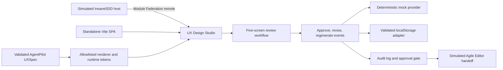

# UX Design Studio

An independent proof-of-work concept extension for InsaneSDD 2.0. It is **not** an official InfoBeans product or feature, and it is not a production system.

## Why this demo?

- This demo shows lead ability to own the full frontend lifecycle: requirements, architecture, implementation, testing, deployment, and presentation.
- It is a practical way to showcase React, TypeScript, micro-frontend, accessibility, performance, and enterprise workflow experience.
- More than showing screens, it demonstrates how I make engineering decisions, define boundaries, manage risk, and build something that can integrate with a larger SaaS platform.
- This is an independent proof-of-work created specifically to demonstrate engineering and product-thinking capabilities.

## What this is about

- Inspired by InsaneSDD, this POC explores how its UX design stage could become more visual and interactive.
- It turns a structured UX specification into responsive screen previews that reviewers can inspect, revise, regenerate, and approve.
- It also shows how the module can run on its own or integrate into a React host using Module Federation.

### Architecture at a glance

Two entry paths reach the same React app: a standalone Vite SPA, and a simulated InsaneSDD host that loads the studio through Module Federation. A validated AgentPilot UXSpec drives an allowlisted renderer and runtime `--uxds-*` tokens. Reviewers approve, revise, or regenerate screens; those actions append governance events. Regeneration uses a deterministic mock provider. State rehydrates through a validated localStorage adapter. Selectors derive the audit log and approval gate. In federated mode, gate completion updates the host and opens a simulated Agile Editor — not a real Agile plan, backend, LLM, or authentication flow.



### Repository structure

A pnpm monorepo with the core modules kept at the top level so apps, shared packages, docs, and tooling stay separate:

```text
apps/
  ux-design-studio/    standalone Vite SPA (@uxds/studio): renderer, governance, review workflow
  insanesdd-host/      simulated InsaneSDD host (@uxds/host) that loads the studio via Module Federation
packages/
  uxds-host-contract/  Zod-validated host ↔ remote contract (@uxds/host-contract)
docs/                  PRD, technical architecture, ADRs, traceability, release notes
e2e/                   cross-app Playwright specs (standalone + federation)
scripts/               GitHub Project import, CI signature checks, agent tooling
.agents/               run manifests, story-loop skill, independent verifier
.github/               CI quality gate, PR template, plan import data
```

## Best practices showcase (senior frontend checklist)

Interview-oriented checklist of practices that are **practically implemented** in this repository. Each item links to evidence so claims can be verified in code or docs. A short honest "deliberately not used" list follows.

### Engineering and delivery process

| Capability                                                                             | Why used                                                                            | Page link                                                                                                                                                                                              |
| -------------------------------------------------------------------------------------- | ----------------------------------------------------------------------------------- | ------------------------------------------------------------------------------------------------------------------------------------------------------------------------------------------------------ |
| Epics, stories, tasks, stable keys, DoR/DoD, and WIP limit 1                           | Defines a structured Agile delivery plan.                                           | [Development plan](docs/UX_Design_Studio_Development_Plan_v1.0.md) · [Plan data](.github/import/development-plan.json)                                                                                 |
| GitHub Projects validation and import automation                                       | Validates and imports the delivery plan consistently.                               | [Import script](scripts/import-github-project.ts)                                                                                                                                                      |
| `<type>/uxds-<issue>-<slug>`, `staging` / `main`, merge commits, and retained branches | Keeps feature work reviewable and separates integration from release.               | [Agent guide](AGENTS.md)                                                                                                                                                                               |
| Conventional Commits, signed commits, and fail-closed signature verification           | Provides consistent history and verifiable authorship.                              | [Signature check](scripts/ci/verify-commit-signatures.ts)                                                                                                                                              |
| Pull request summary, acceptance criteria, and verification template                   | Makes PR scope and verification explicit.                                           | [PR template](.github/pull_request_template.md)                                                                                                                                                        |
| Lint, typecheck, unit tests, build, Playwright e2e, and signature CI gates             | Runs the complete quality gate with pinned Actions and concurrency cancellation.    | [Quality workflow](.github/workflows/quality.yml)                                                                                                                                                      |
| ADRs, PRD-to-test traceability, release gates, release notes, and `v0.1.0-poc`         | Connects requirements to architecture, issues, code, tests, and release acceptance. | [ADRs](docs/architecture-decisions.md) · [Traceability](docs/traceability.md) · [Acceptance](docs/release-acceptance.md) · [Release notes](docs/release-notes-v0.1.0-poc.md)                           |
| Run manifests, read-only verifier, and agent-control validation                        | Enforces authorized, independently verified delivery.                               | [Run controls](.agents/) · [Story loop](.agents/skills/uxds-story-loop/SKILL.md) · [Verifier](.agents/verifiers/uxds-story-verifier.md) · [Validation script](scripts/agent/validate-agent-control.ts) |
| Vercel static SPA deployment with deep-link rewrites                                   | Supports static hosting and client-side routes.                                     | [Vercel config](apps/ux-design-studio/vercel.json)                                                                                                                                                     |
| GitHub branch protection and required checks                                           | Documents required remote repository protections.                                   | [Agent guide](AGENTS.md)                                                                                                                                                                               |

### Architecture

| Capability                                                    | Why used                                                                                    | Page link                                                                                                                           |
| ------------------------------------------------------------- | ------------------------------------------------------------------------------------------- | ----------------------------------------------------------------------------------------------------------------------------------- |
| Route-level Module Federation with `@module-federation/vite`  | Lets the studio run standalone or inside the simulated host while sharing React singletons. | [Studio config](apps/ux-design-studio/module-federation.config.ts) · [Host config](apps/insanesdd-host/module-federation.config.ts) |
| `RemoteErrorBoundary`, retry, and remote-failure e2e coverage | Prevents a failed remote from crashing the host.                                            | [Error boundary](apps/insanesdd-host/src/federation/RemoteErrorBoundary.tsx) · [E2E proof](e2e/federation/remote-failure.spec.ts)   |
| Zod-validated host ↔ remote contract                          | Rejects malformed host-to-remote data at the integration boundary.                          | [Contract parser](packages/uxds-host-contract/src/parse-contract.ts)                                                                |
| pnpm workspace with `apps/*` and `packages/*`                 | Coordinates apps and shared packages in one monorepo.                                       | [Workspace config](pnpm-workspace.yaml)                                                                                             |
| Feature flags for optional modules                            | Keeps optional capabilities independently removable.                                        | [App config](apps/ux-design-studio/src/app/config.ts)                                                                               |

### Frontend (React) patterns

| Capability                                                                                          | Why used                                                                                                                             | Page link                                                                                                                                                                                                                                    |
| --------------------------------------------------------------------------------------------------- | ------------------------------------------------------------------------------------------------------------------------------------ | -------------------------------------------------------------------------------------------------------------------------------------------------------------------------------------------------------------------------------------------- |
| `useState`, `useMemo`, `useCallback`, `useContext`, `useRef`, `useId`, and `useEffect` with cleanup | Manages local state, derived values, stable callbacks, shared context, DOM references, accessible IDs, and external synchronization. | [Provider](apps/ux-design-studio/src/features/governance/GovernanceProvider.tsx) · [Context](apps/ux-design-studio/src/features/governance/governance-context.ts)                                                                            |
| `useGovernance`, `useStudioRouting`, and `useGateEvents`                                            | Reuses domain-specific governance, routing, and host gate-event behavior.                                                            | [Context](apps/ux-design-studio/src/features/governance/governance-context.ts) · [Routing](apps/ux-design-studio/src/app/studio-routing.tsx) · [Gate events](apps/ux-design-studio/src/integration/use-gate-events.ts)                       |
| `AbortController`                                                                                   | Cancels stale asynchronous regeneration through the provider port.                                                                   | [Governance provider](apps/ux-design-studio/src/features/governance/GovernanceProvider.tsx)                                                                                                                                                  |
| Route, `NodeErrorBoundary`, and `RemoteErrorBoundary` layers                                        | Isolates route, render-node, and federated-remote failures.                                                                          | [Route boundary](apps/ux-design-studio/src/app/error-boundary.tsx) · [Node boundary](apps/ux-design-studio/src/renderer/composer/NodeErrorBoundary.tsx) · [Remote boundary](apps/insanesdd-host/src/federation/RemoteErrorBoundary.tsx)      |
| `React.lazy` and `Suspense`                                                                         | Loads the federated remote only when needed and shows a fallback while waiting.                                                      | [Federated studio](apps/insanesdd-host/src/federation/FederatedUxDesignStudio.tsx)                                                                                                                                                           |
| Pure reducer, append-only events, derived selectors, and deep-frozen inputs                         | Keeps governance event-sourced and derives state from one source of truth.                                                           | [Reducer](apps/ux-design-studio/src/domain/governance/governance-reducer.ts) · [Selectors](apps/ux-design-studio/src/domain/governance/selectors.ts)                                                                                         |
| `RecursiveComposer`, allowlisted registry, depth guard, and declarative actions                     | Safely renders validated nodes through one recursive path.                                                                           | [Composer](apps/ux-design-studio/src/renderer/composer/RecursiveComposer.tsx) · [Registry](apps/ux-design-studio/src/renderer/registry/create-registry.ts) · [Actions](apps/ux-design-studio/src/renderer/actions/create-action-resolver.ts) |
| CSS Modules and runtime `--uxds-*` design tokens                                                    | Applies validated themes without leaking styles globally.                                                                            | [Token mapper](apps/ux-design-studio/src/renderer/theming/token-mapper.ts)                                                                                                                                                                   |

### TypeScript rigor

| Capability                                                                               | Why used                                                                             | Page link                                                                                                                                            |
| ---------------------------------------------------------------------------------------- | ------------------------------------------------------------------------------------ | ---------------------------------------------------------------------------------------------------------------------------------------------------- |
| `strict`, `noUncheckedIndexedAccess`, `exactOptionalPropertyTypes`, and no-unused checks | Finds unsafe indexing, optional-property, and unused-code issues during development. | [TypeScript config](apps/ux-design-studio/tsconfig.app.json)                                                                                         |
| Discriminated unions, exhaustive `never`, Result types, `satisfies`, and `as const`      | Makes state transitions exhaustive and expected failures explicit.                   | [Reducer](apps/ux-design-studio/src/domain/governance/governance-reducer.ts) · [Selectors](apps/ux-design-studio/src/domain/governance/selectors.ts) |

### Security

| Capability                                                                     | Why used                                                               | Page link                                                                                                                                                                                                                     |
| ------------------------------------------------------------------------------ | ---------------------------------------------------------------------- | ----------------------------------------------------------------------------------------------------------------------------------------------------------------------------------------------------------------------------- |
| Zod validation for UXSpec, provider output, localStorage, and host props       | Treats every external structured-data boundary as untrusted.           | [UXSpec loader](apps/ux-design-studio/src/domain/ux-spec/load-ux-spec.ts) · [Contract parser](packages/uxds-host-contract/src/parse-contract.ts)                                                                              |
| No `dangerouslySetInnerHTML` / `eval`, URL allowlist, and hardened tokens      | Blocks executable content, unsafe protocols, and arbitrary CSS values. | [Schemas](apps/ux-design-studio/src/domain/ux-spec/schemas.ts) · [Registry tests](apps/ux-design-studio/src/renderer/registry/registry.test.tsx) · [Token mapper](apps/ux-design-studio/src/renderer/theming/token-mapper.ts) |
| Versioned persistence envelope and scoped reset without `localStorage.clear()` | Recovers safely from corruption and resets only managed state.         | [Envelope](apps/ux-design-studio/src/infrastructure/persistence/persisted-governance-envelope.ts) · [Repository](apps/ux-design-studio/src/infrastructure/persistence/local-storage-governance-repository.ts)                 |

### Accessibility (WCAG 2.1 AA target)

| Capability                                                                                  | Why used                                                                        | Page link                                                                                           |
| ------------------------------------------------------------------------------------------- | ------------------------------------------------------------------------------- | --------------------------------------------------------------------------------------------------- |
| Semantic roles, ARIA, focus trap, arrow-key tabs, `aria-live`, and `prefers-reduced-motion` | Supports keyboard use, focus management, announcements, and motion preferences. | [Reset control](apps/ux-design-studio/src/features/audit/ResetDemoStateControl.tsx)                 |
| Role, keyboard-flow, and reduced-motion assertions                                          | Protects accessible behavior with automated checks.                             | [E2E tests](e2e/standalone/standalone-smoke.spec.ts) · [CI workflow](.github/workflows/quality.yml) |

### Testing

| Capability                                                                | Why used                                                     | Page link                                                                                                                                                                                                                                                                  |
| ------------------------------------------------------------------------- | ------------------------------------------------------------ | -------------------------------------------------------------------------------------------------------------------------------------------------------------------------------------------------------------------------------------------------------------------------- |
| Vitest, React Testing Library, and user-event                             | Verifies user-visible React component behavior.              | [Vitest config](apps/ux-design-studio/vitest.config.ts) · [CI workflow](.github/workflows/quality.yml)                                                                                                                                                                     |
| UXSpec, registry, persistence, host-contract, and provider boundary tests | Verifies validation and recovery at system boundaries.       | [UXSpec tests](apps/ux-design-studio/src/domain/ux-spec/load-ux-spec.test.ts) · [Persistence tests](apps/ux-design-studio/src/infrastructure/persistence/local-storage-governance-repository.test.ts) · [Host contract](packages/uxds-host-contract/src/parse-contract.ts) |
| Critical demo-flow integration test                                       | Proves the main review and approval workflow across modules. | [Integration test](apps/ux-design-studio/src/app/critical-demo-flow.integration.test.tsx)                                                                                                                                                                                  |
| Playwright standalone and federation projects                             | Verifies cross-app behavior in real browsers.                | [Playwright config](playwright.config.ts) · [Federation test](e2e/federation/remote-failure.spec.ts)                                                                                                                                                                       |

### Deliberately not used (and why)

These common senior-interview topics are **intentionally absent** here; they are not missing by accident:

| Capability                                 | Why not used                                                                         | Page link                                                                               |
| ------------------------------------------ | ------------------------------------------------------------------------------------ | --------------------------------------------------------------------------------------- |
| React `useReducer`                         | The pure reducer is framework-free; React uses `useState` and provider wiring.       | [Governance reducer](apps/ux-design-studio/src/domain/governance/governance-reducer.ts) |
| `React.memo` and portals                   | The POC has no measured need; error boundaries and scoped CSS provide isolation.     | [Route boundary](apps/ux-design-studio/src/app/error-boundary.tsx)                      |
| Studio route-level code splitting          | The five-screen SPA is small; the federated remote is the intentional split point.   | [Federated studio](apps/insanesdd-host/src/federation/FederatedUxDesignStudio.tsx)      |
| axe / jest-axe CI scans                    | Behavioral unit and Playwright tests cover the targeted accessibility flows.         | [E2E tests](e2e/standalone/standalone-smoke.spec.ts)                                    |
| Coverage thresholds, commitlint, and husky | CI enforces lint, types, tests, builds, e2e, and signed commits without local hooks. | [Quality workflow](.github/workflows/quality.yml)                                       |
| Real backend, LLM, or production auth      | These are outside the approved POC boundaries.                                       | [Run the demo](#run-the-demo)                                                           |

## Run the demo

Prerequisites: Node.js **22+**, pnpm via Corepack (`pnpm@10.13.1`). No app secrets or environment variables are required for the standalone studio.

```bash
corepack enable
corepack pnpm install
pnpm run dev
```

Open [http://127.0.0.1:5173](http://127.0.0.1:5173).

Optional federated host mode:

```bash
pnpm run build:studio
VITE_UXDS_REMOTE_ENTRY=http://127.0.0.1:4174/remoteEntry.js pnpm run build:host
pnpm --filter @uxds/studio exec vite preview --host 127.0.0.1 --port 4174
pnpm --filter @uxds/host exec vite preview --host 127.0.0.1 --port 4173
```

Then open `http://127.0.0.1:4173/projects/project-agentpilot/ux-design-studio/overview`.

POC boundaries: no real backend, LLM, authentication, or Agile-plan generation. The host is simulated; demo reset only clears the managed governance storage key.

## Test and build

```bash
pnpm run lint
pnpm run typecheck
pnpm run test
pnpm run test:e2e
pnpm run build
```

CI runs the same quality gate (lint, typecheck, unit tests, build), Playwright e2e, and fail-closed commit-signature checks on pull requests and pushes to `staging` / `main`. See [`.github/workflows/quality.yml`](.github/workflows/quality.yml).

## Project documents

- [`docs/UX_Design_Studio_PRD_v1.0.md`](docs/UX_Design_Studio_PRD_v1.0.md)
- [`docs/UX_Design_Studio_Technical_Architecture_v1.0.md`](docs/UX_Design_Studio_Technical_Architecture_v1.0.md)
- [`docs/Federated_Host_Integration_Architecture_v1.0.md`](docs/Federated_Host_Integration_Architecture_v1.0.md)
- [`docs/architecture-decisions.md`](docs/architecture-decisions.md)
- [`docs/demo-script.md`](docs/demo-script.md)
- [`AGENTS.md`](AGENTS.md)
