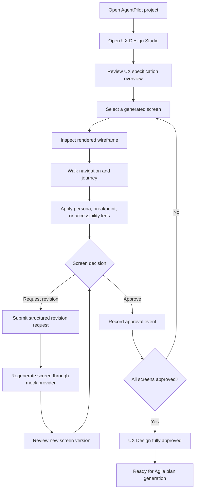

# Product Requirements Document

## UX Design Studio: Visual Preview and Approval Workbench for InsaneSDD 2.0

> **Document type:** Product Requirements Document  
> **PRD version:** 1.0  
> **Source baseline:** UX Design Studio - Source of Truth v1.0, frozen  
> **Product type:** Proof-of-work concept extension, not an official InfoBeans product  
> **Target date:** July 17, 2026  
> **Maximum delivery effort:** 50 build hours  
> **Status:** Draft for approval  
> **Owner:** Mathan K A

---

## 1. Document authority and scope control

This PRD derives directly from the frozen **UX Design Studio - Source of Truth v1.0**.

The Source of Truth remains the controlling baseline. This PRD translates that baseline into product requirements without changing the agreed product direction, delivery cap, mandatory capabilities, cut-line, or exclusions.

### Scope-control rules

- Any conflict between this PRD and the Source of Truth is resolved in favor of the Source of Truth.
- Any new capability requires a new Source of Truth version before it enters the backlog.
- The 50-hour cap is a hard delivery constraint.
- Features listed under the cut-line may be removed only in the defined order.
- Rendering, token theming, per-screen approval, audit logging, and AgentPilot seed-data fidelity must not be removed.

---

## 2. Executive summary

InsaneSDD 2.0 demonstrates a human-supervised AI delivery workflow with approval gates for requirement interpretation, baseline freezing, UX design, and execution.

In the publicly demonstrated UX flow, stakeholders review personas, journeys, screen definitions, component inventories, design-system rules, accessibility requirements, and performance considerations primarily as text. They must then approve the complete UX design, request a full revision, or rerun the UX agent without first reviewing rendered screens.

UX Design Studio strengthens this gate by rendering the generated UX specification as interactive, navigable, design-token-themed wireframes. It allows stakeholders to review screens individually, inspect them through persona, responsive, and accessibility lenses, approve each screen independently, and submit structured revision requests tied to the frozen requirement baseline.

The proof of concept must demonstrate both product value and Lead Frontend engineering capability within 50 hours.

---

## 3. Product context

### 3.1 Relationship to InsaneSDD 2.0

UX Design Studio is a complementary concept extension. It does not replace an existing InsaneSDD module and must not be presented as an official product capability.

It fits between:

```text
Generated UX Design review
        ↓
UX Design Studio visual review and approval
        ↓
Agile Editor and plan generation
```

### 3.2 Product input

The module consumes a versioned UX specification represented as a typed `UXSpec` document containing:

- Personas
- User journeys
- Screens
- Component definitions
- Design tokens
- Navigation rules
- Responsive behavior
- Accessibility requirements
- Performance considerations

### 3.3 Product output

The module produces:

- Per-screen approval states
- Structured revision requests
- Screen regeneration events
- Screen-version references
- Audit events linked to the frozen requirement baseline
- A final UX gate-completion state

### 3.4 Positioning constraint

All descriptions and demonstrations must use language equivalent to:

> A concept extension for InsaneSDD 2.0 that deepens UX review into a visual, per-screen approval workbench.

The product must not be represented as an official InfoBeans feature or as proof that the production platform lacks a particular capability.

---

## 4. Problem statement

Stakeholders are asked to approve a UX specification before they can inspect a rendered representation of its proposed screens and flows.

This creates four practical problems:

- Non-technical stakeholders may approve text they cannot confidently evaluate.
- Screen-level design issues can remain hidden until implementation.
- A concern with one screen can force an all-or-nothing revision of the full UX output.
- Approval evidence is less useful when reviewers cannot connect decisions to specific rendered screens and components.

The opportunity is to move design validation earlier, while preserving InsaneSDD's human-supervised, traceable approval model.

---

## 5. Product vision

Enable stakeholders to **see, navigate, evaluate, revise, and approve AI-generated UX screens before development planning begins**.

---

## 6. Value proposition

### For product owners and project managers

Review the proposed experience visually before committing the project to implementation planning.

### For UX and design stakeholders

Validate screen structure, navigation, responsive behavior, and design-token application across the generated experience.

### For compliance reviewers

Inspect accessibility annotations and record approval or revision evidence before sign-off.

### For frontend and engineering leads

Confirm that the proposed screens and component inventory form a coherent implementation contract.

### For enterprise delivery organizations

Reduce late design discovery and strengthen auditability across requirement, design, approval, and execution stages.

---

## 7. Goals

| ID | Goal |
|---|---|
| G-01 | Render UX specification data as interactive wireframes instead of text-only screen descriptions. |
| G-02 | Apply the specification's design tokens consistently across every rendered screen. |
| G-03 | Support navigation across the five AgentPilot screens so reviewers can evaluate complete flows. |
| G-04 | Replace all-or-nothing UX approval with per-screen approval and structured revision requests. |
| G-05 | Link every approval, revision, and regeneration event to the frozen baseline and relevant screen. |
| G-06 | Support persona, responsive, and accessibility review lenses. |
| G-07 | Demonstrate a provider boundary for future AI regeneration without requiring a real LLM in the POC. |
| G-08 | Deliver a polished, deployable, explainable frontend proof of concept within 50 hours. |

---

## 8. Non-goals

The following are explicitly outside the POC scope:

- Drag-and-drop screen editing
- Freeform visual design editing
- Real LLM or production UX-agent calls
- Production backend services
- Persistence beyond browser storage
- Production authentication or SSO
- Production authorization enforcement
- Multi-project support
- Multi-repository support
- Production-grade wireframe-to-code fidelity
- Pixel-perfect final visual design
- Production event streaming into InsaneSDD
- Production API implementation
- Production retention, signed audit events, or OIDC integration

Production integration may be documented in an Architecture Decision Record, but it must not be implemented within the POC.

---

## 9. Users, buyers, and stakeholders

### 9.1 Primary product users

| User | Role in workflow | Primary need |
|---|---|---|
| Alex | Product Owner or Product Manager | Review and approve individual screens before development planning. |
| Taylor | Compliance Officer | Inspect accessibility evidence and verify compliance-related concerns before sign-off. |
| Jordan | Frontend or Engineering Lead | Validate screen structure, components, navigation, and implementation readiness. |
| UX or Design stakeholder | Design reviewer | Evaluate design-system application, journeys, responsive layouts, and revision requests. |

### 9.2 Buyers and organizational stakeholders

- Enterprise software-delivery organizations
- Engineering and delivery leadership
- Product and design leadership
- InfoBeans sales and demonstration stakeholders

### 9.3 POC evaluation audience

The interview or demonstration evaluator is not a product persona. This audience evaluates:

- Product judgment
- Frontend architecture
- Rendering-engine design
- State-management boundaries
- Accessibility execution
- Testability
- Scope discipline
- Production-integration thinking

---

## 10. Assumptions and constraints

### Assumptions

- A frozen requirement baseline already exists.
- The UX Design Agent has already generated a complete UX specification.
- The AgentPilot example remains the seed project used for the demonstration.
- The POC uses deterministic seed data and mocked regeneration results.
- The POC runs as a static frontend application.
- Browser storage is sufficient for demonstrating approvals and audit events.

### Constraints

- Total implementation time must not exceed 50 hours.
- The application must be deployable to Vercel or Netlify.
- The POC must not require a backend.
- The visual language should align with the demonstrated InsaneSDD interface.
- The POC must remain demonstrable without external service availability.
- Scope cuts must follow the frozen cut-line order.

---

## 11. End-to-end user workflow



### Workflow stages

#### Entry

The user opens UX Design Studio after the UX Design Agent has generated a specification against frozen baseline v1.

#### Overview

The product displays:

- Three personas
- Three journeys
- Five screens
- Approximately 30 components
- Design-system summary
- Current approval progress

#### Screen review

The reviewer selects one of the five screens:

- Dashboard
- Task Detail
- Workflow Templates
- Reports Export
- Login

The selected screen is composed at runtime from the UX specification and component registry.

#### Interactive review

The reviewer may:

- Navigate between screens
- Change the active persona lens
- Switch between mobile, tablet, and desktop previews
- Enable the accessibility annotation overlay
- Inspect current screen-version information

#### Decision

For each screen, an authorized approver may:

- Approve the screen
- Request a structured revision
- Trigger mocked regeneration after providing revision context

#### Completion

When every required screen is approved, the product displays:

> UX Design fully approved. Ready for Agile plan generation.

---

## 12. Functional requirements

### 12.1 UX specification overview

| ID | Requirement | Priority |
|---|---|---|
| FR-001 | The product must display an overview of the loaded UX specification. | Must |
| FR-002 | The overview must show persona, journey, screen, component, and approval counts. | Must |
| FR-003 | The overview must display per-screen approval state and overall approval progress. | Must |
| FR-004 | The user must be able to open any of the five AgentPilot screens from the overview or screen navigation. | Must |

### 12.2 Spec-driven rendering

| ID | Requirement | Priority |
|---|---|---|
| FR-010 | The product must render screen definitions from the typed UX specification at runtime. | Must |
| FR-011 | The renderer must resolve screen nodes through a component registry. | Must |
| FR-012 | The registry must support approximately 12 to 15 component types across layout, forms, navigation, data display, feedback, and charts. | Must |
| FR-013 | All five seeded AgentPilot screens must render through the same specification-driven rendering path. | Must |
| FR-014 | Rendering behavior must not depend on hard-coded page-specific React screens as the primary implementation model. | Must |
| FR-015 | The interface must provide loading, empty, error, and partial-data states relevant to the demo path. | Must |

### 12.3 Design-token theming

| ID | Requirement | Priority |
|---|---|---|
| FR-020 | The product must apply palette, typography, spacing, and layout tokens from the UX specification. | Must |
| FR-021 | Design tokens must affect all rendered screens consistently. | Must |
| FR-022 | Token changes must update the rendered preview without a page reload. | Must |
| FR-023 | The default visual treatment must align with the demonstrated InsaneSDD visual language, including light chrome, red accent, and sidebar-oriented navigation. | Must |

### 12.4 Navigation and journey review

| ID | Requirement | Priority |
|---|---|---|
| FR-030 | Desktop preview must support sidebar navigation. | Must |
| FR-031 | Mobile preview must support the specified compact or hamburger navigation model. | Must |
| FR-032 | Navigation actions must move between the seeded screens according to the UX specification. | Must |
| FR-033 | The active screen must be identifiable. | Must |
| FR-034 | The product should support guided walkthrough of one seeded user journey. | Should, first cut-line item |

### 12.5 Persona lens

| ID | Requirement | Priority |
|---|---|---|
| FR-040 | The reviewer must be able to select Alex, Jordan, or Taylor as the active persona lens. | Must |
| FR-041 | The active lens must display relevant goals, frustrations, and journey touchpoints for the current screen. | Must |
| FR-042 | Persona annotations must remain visually distinct from the rendered product screen. | Must |

### 12.6 Responsive preview

| ID | Requirement | Priority |
|---|---|---|
| FR-050 | The reviewer must be able to switch among mobile, tablet, and desktop preview modes. | Must, tablet is cuttable |
| FR-051 | Layout must recompose without reloading the application. | Must |
| FR-052 | Mobile preview must use the specification's stacked, mobile-first behavior. | Must |
| FR-053 | Larger previews must support multi-column or grid arrangements where specified. | Must |

### 12.7 Accessibility review overlay

| ID | Requirement | Priority |
|---|---|---|
| FR-060 | The reviewer must be able to enable or disable an accessibility annotation overlay. | Should, cuttable after version history |
| FR-061 | The overlay must surface contrast status, ARIA role or label information, and screen-reader notes where represented in the seed specification. | Should |
| FR-062 | If the full overlay is cut, minimum contrast-status badges must remain. | Must |

### 12.8 Per-screen approval

| ID | Requirement | Priority |
|---|---|---|
| FR-070 | Each screen must have its own approval state. | Must |
| FR-071 | An Approver must be able to approve the active screen. | Must |
| FR-072 | Approval must record actor, action, screen ID, baseline version, timestamp, and relevant payload. | Must |
| FR-073 | Approval progress must update after each decision. | Must |
| FR-074 | Approval of one screen must not automatically approve another screen. | Must |
| FR-075 | The completion state must appear only when every required screen is approved. | Must |

### 12.9 Structured revision requests

| ID | Requirement | Priority |
|---|---|---|
| FR-080 | An Approver must be able to request revision for the active screen. | Must |
| FR-081 | The revision form must capture affected component or components, issue category, and description. | Must |
| FR-082 | The revision request must reference the active screen, screen version, specification version, and frozen baseline version. | Must |
| FR-083 | Submitting a revision request must create an audit event. | Must |

### 12.10 Mocked screen regeneration

| ID | Requirement | Priority |
|---|---|---|
| FR-090 | The product must expose screen regeneration through a `DesignAgentProvider` boundary. | Must |
| FR-091 | The POC provider must return a deterministic, pre-authored screen variant. | Must |
| FR-092 | Regeneration must show simulated latency and a loading state. | Must |
| FR-093 | Regeneration must create a new screen-version reference. | Should, version history is cuttable |
| FR-094 | At least one screen should demonstrate a prior and regenerated version. | Should |
| FR-095 | No real LLM call may be required for the demo. | Must |

### 12.11 Audit log

| ID | Requirement | Priority |
|---|---|---|
| FR-100 | The product must provide an audit-log view. | Must |
| FR-101 | Approval, revision-request, and regeneration actions must appear as append-only events. | Must |
| FR-102 | Events must be displayed chronologically. | Must |
| FR-103 | Events must identify actor, action, screen, baseline version, timestamp, and relevant payload. | Must |
| FR-104 | Audit events must survive page reload through browser persistence. | Must |
| FR-105 | The reviewer should be able to inspect events associated with an individual screen. | Must |

### 12.12 Fixed review actor

| ID | Requirement | Priority |
|---|---|---|
| FR-110 | The POC must use Demo Approver as the fixed review actor without exposing role-simulation UI. | Must |
| FR-111 | Only the Approver role may approve screens, request revision, or trigger regeneration. | Must |
| FR-112 | The fixed Demo Approver must not be presented as production authentication, SSO, RBAC, or identity verification. | Must |

---

## 13. User stories and acceptance criteria

### Epic E1: UX specification visibility

#### US-1.1: View specification summary

**As a** Product Owner  
**I want** to see the generated UX specification summarized in one place  
**So that** I understand the size and current review state before inspecting individual screens.

**Acceptance criteria**

- The overview shows three personas, three journeys, five screens, and approximately 30 components.
- The overview displays the design-system summary.
- Each screen displays its current review state.
- Overall approval progress is visible.

#### US-1.2: Open a generated screen

**As a** reviewer  
**I want** to open any generated screen from the overview  
**So that** I can inspect its rendered representation.

**Acceptance criteria**

- All five AgentPilot screens are selectable.
- Selecting a screen loads its rendered wireframe.
- The selected screen is visibly identified.
- A rendering failure produces an understandable error state rather than a broken application shell.

---

### Epic E2: Visual and interactive review

#### US-2.1: Review a rendered wireframe

**As a** stakeholder  
**I want** the UX specification rendered as a screen  
**So that** I can evaluate the proposed experience without interpreting raw specification text.

**Acceptance criteria**

- Every seeded screen is generated through the specification renderer.
- The screen uses the registered component types.
- Layout, forms, navigation, data display, feedback, and charts are represented where required by the seed data.
- Loading, empty, and error states are demonstrated in the product where relevant.

#### US-2.2: Review design-token application

**As a** design stakeholder  
**I want** the screen to use the generated design-system tokens  
**So that** I can verify visual consistency across the experience.

**Acceptance criteria**

- Palette, typography, and spacing tokens are applied at runtime.
- Every screen uses the same token source.
- Updating a token refreshes the preview without reloading the application.

#### US-2.3: Navigate between screens

**As a** Product Owner  
**I want** to navigate through the proposed product  
**So that** I can evaluate its flow rather than reviewing isolated screen descriptions.

**Acceptance criteria**

- Desktop mode exposes sidebar navigation.
- Mobile mode exposes compact navigation.
- Navigation moves between valid seeded screens.
- The current destination is highlighted.

---

### Epic E3: Contextual review lenses

#### US-3.1: Review through a persona lens

**As a** stakeholder  
**I want** to select a persona while reviewing a screen  
**So that** I can judge whether the design supports that persona's goals and workflow.

**Acceptance criteria**

- Alex, Jordan, and Taylor are selectable.
- The active persona's goals, frustrations, and journey touchpoints appear for the current screen.
- Persona annotations do not alter the underlying screen specification.

#### US-3.2: Review responsive behavior

**As a** design reviewer  
**I want** to switch preview breakpoints  
**So that** I can verify the mobile-first layout strategy.

**Acceptance criteria**

- Mobile, tablet, and desktop modes are available unless tablet is removed through the cut-line.
- Breakpoint switching occurs without a page reload.
- Mobile layouts stack content where specified.
- Larger layouts use multi-column or grid arrangements where specified.

#### US-3.3: Review accessibility annotations

**As a** Compliance Officer  
**I want** accessibility annotations displayed with the screen  
**So that** I can inspect evidence before sign-off.

**Acceptance criteria**

- The overlay can be enabled and disabled.
- Available contrast, ARIA, and screen-reader annotations are shown.
- Minimum contrast badges remain even if the full overlay is removed through the cut-line.

#### US-3.4: Walk a user journey

**As a** Product Owner  
**I want** a guided journey walkthrough  
**So that** I can evaluate a complete task flow.

**Acceptance criteria**

- One seeded journey can be started from its first screen.
- The current journey step is visible.
- The reviewer can move forward and backward through the journey.
- This story is the first item removed if the schedule cut-line is activated.

---

### Epic E4: Screen-level governance

#### US-4.1: Approve an individual screen

**As an** Approver  
**I want** to approve one screen independently  
**So that** accepted work can remain approved while other screens are revised.

**Acceptance criteria**

- Approval applies only to the active screen and version.
- The event includes actor, screen, baseline version, and timestamp.
- Approval state is visible on the screen and overview.
- The decision survives page reload.

#### US-4.2: Request a structured revision

**As an** Approver  
**I want** to describe a screen-level issue in a structured form  
**So that** the revision request is specific and traceable.

**Acceptance criteria**

- The form captures affected components, issue category, and description.
- Required fields are validated.
- The request is linked to the active screen, version, and baseline.
- The request appears in the audit log.

#### US-4.3: Regenerate a screen

**As an** Approver  
**I want** to regenerate the selected screen using my revision request  
**So that** I can evaluate a revised variant without rerunning the entire UX design.

**Acceptance criteria**

- Regeneration is invoked through the provider abstraction.
- The POC displays a loading state.
- The mock provider returns a pre-authored variant.
- The regeneration action appears in the audit log.
- A new screen-version reference is created when version history remains in scope.

#### US-4.4: Inspect governance history

**As a** reviewer  
**I want** to inspect approval and revision history  
**So that** I can understand who decided what and against which baseline.

**Acceptance criteria**

- Events are listed chronologically.
- Each event identifies actor, action, screen, version, baseline, and timestamp.
- Events are append-only from the product user's perspective.
- Events persist locally across reloads.

#### US-4.5: Complete the UX approval gate

**As a** Product Owner  
**I want** the product to confirm when every screen is approved  
**So that** I know the UX output is ready for Agile plan generation.

**Acceptance criteria**

- Completion is unavailable while any required screen is unapproved.
- Completion appears immediately after the final required approval.
- The completion message explicitly states readiness for Agile plan generation.

---

### Epic E5: Fixed-actor governance demonstration

#### US-5.1: Use the fixed Demo Approver

**As a** demonstration evaluator  
**I want** governance actions to use one deterministic review actor
**So that** the workflow stays focused on screen decisions rather than role simulation.

**Acceptance criteria**

- Demo Approver is the default product actor.
- No role switcher, role choices, or active-actor label appears in the UI.
- Approval, revision, and regeneration events remain actor-attributed.
- Command-level capability enforcement remains covered by internal tests.
- Demo Approver is not presented as production authentication.

---

## 14. Business rules

| ID | Rule |
|---|---|
| BR-001 | A screen is approved independently from all other screens. |
| BR-002 | Gate completion requires approval of every required screen. |
| BR-003 | Approval and revision events must reference frozen baseline v1. |
| BR-004 | Regeneration may affect only the selected screen in the POC. |
| BR-005 | Prior screen versions remain reviewable only while version history remains within the cut-line. |
| BR-006 | Only the mocked Approver role may execute governance actions. |
| BR-007 | Audit events are append-only from the user's perspective. |
| BR-008 | No real AI, backend, SSO, or production repository integration may be required. |
| BR-009 | The product is a concept extension, not an official InfoBeans module. |
| BR-010 | The cut-line is binding when implementation exceeds the approved effort. |

---

## 15. Business-level data requirements

The PRD requires the following product entities. Technical schemas belong in the subsequent architecture document.

| Entity | Required information |
|---|---|
| UX Specification | ID, version, baseline version, personas, journeys, screens, design tokens, navigation, accessibility requirements |
| Screen | ID, name, component tree, navigation references, accessibility annotations, current version |
| Component node | ID, registered type, properties, children, accessibility metadata |
| Persona | ID, name, role, goals, frustrations, journey touchpoints |
| Journey | ID, name, persona, ordered steps, related screens |
| Approval state | Screen ID, screen version, status, actor, timestamp |
| Revision request | Screen ID, version, affected components, category, description, actor, timestamp |
| Audit event | Actor, action, screen ID, screen version, specification version, baseline version, timestamp, payload |
| Design tokens | Palette, typography, spacing, and layout values |

---

## 16. Non-functional requirements

### 16.1 Accessibility

- The studio itself must target WCAG 2.1 AA.
- Core workflows must be keyboard accessible.
- Focus movement must remain understandable during dialogs, panels, and screen changes.
- Interactive controls must expose appropriate accessible names and roles.
- The accessibility overlay must not make the underlying studio inaccessible.

### 16.2 Performance

- Screen definitions should be lazy-loaded where practical.
- Rendering should avoid unnecessary recomposition.
- Interaction handlers should be debounced where appropriate.
- Screen switching should feel immediate during the demonstration.
- The deployed POC must remain responsive on a normal modern laptop and browser.

No strict production SLA is asserted because this is a static POC with seeded data.

### 16.3 Reliability

- The primary demonstration flow must complete without an unhandled exception.
- The product must provide clear loading, empty, error, and partial-data states.
- Browser-storage failure or invalid stored state must not make the application unusable.
- Reloading must preserve valid approval and audit state.

### 16.4 Security and privacy

- The POC must not contain production credentials or repository secrets.
- No production user or customer data may be required.
- Seed data must be synthetic and limited to the AgentPilot demonstration context.
- Demo Approver must be treated as a synthetic review actor, not secure authorization.

### 16.5 Maintainability and quality

- TypeScript strict mode is required.
- The rendering engine and approval-state reducer must have unit tests.
- The architecture, scope, limitations, and production integration path must be documented.
- The project must include a README and Architecture Decision Record.
- The deployed build must be reproducible from the repository.

### 16.6 Portability

- The application must operate without a server.
- The build must be deployable to Vercel or Netlify.
- Mocked providers and seed data must make the demonstration independent of external APIs.

---

## 17. POC success criteria

The POC is successful when all mandatory criteria below are met:

| ID | Success criterion |
|---|---|
| SC-001 | All five AgentPilot screens are represented through the spec-driven renderer. |
| SC-002 | The same design-token source visibly affects all screens. |
| SC-003 | A reviewer can navigate between screens and inspect at least the core persona and breakpoint lenses. |
| SC-004 | An Approver can approve screens individually. |
| SC-005 | An Approver can submit a structured screen-level revision request. |
| SC-006 | The mock provider can return a revised screen variant without a real LLM. |
| SC-007 | Approval, revision, and regeneration actions appear in a persistent audit log. |
| SC-008 | Every governance event is traceable to the relevant screen and baseline version. |
| SC-009 | The product reports readiness for Agile plan generation only after all required screens are approved. |
| SC-010 | The deployed core workflow can be demonstrated end to end without errors. |
| SC-011 | The repository includes unit tests, an ADR, a README, and explicit scope exclusions. |
| SC-012 | Total delivery effort does not exceed 50 hours. |

### Product-value hypothesis

The POC should demonstrate that visual, screen-level approval provides more actionable review evidence than approving an undifferentiated text-based UX specification.

This is a hypothesis demonstrated by the POC, not a validated production metric.

---

## 18. Dependencies

### Required POC dependencies

- React and TypeScript frontend environment
- Static AgentPilot UX specification seed data
- Component registry and recursive rendering mechanism
- Browser storage
- Mock design-agent provider
- Static deployment platform

### Documented production dependencies, not implemented

- Versioned UX specification API
- Approval and revision APIs
- AI regeneration endpoint
- Existing InsaneSDD specification store
- Append-only audit-event persistence
- Live Terminal or event-stream integration
- SSO or OIDC
- Production RBAC
- Audit-event signing and retention controls

---

## 19. Risks and mitigations

| Risk | Impact | Mitigation |
|---|---|---|
| Component-registry scope expands beyond the 12 to 15 type cap | Rendering engine consumes the schedule | Preserve the registry cap and reuse component primitives across seed screens. |
| Seed-data authoring takes longer than expected | Core rendering work starts late | Prioritize Dashboard and Login data first, then complete the remaining screens through reusable structures. |
| Journey and annotation features consume polish time | Mandatory approval path remains unfinished | Apply the frozen cut-line immediately when progress misses the approved checkpoint. |
| Mock regeneration becomes over-engineered | Time is lost on non-production AI behavior | Use deterministic, pre-authored variants and simulated latency only. |
| The concept is presented as criticism of a product not fully visible publicly | Credibility risk | Present it only as a concept extension that deepens the demonstrated UX review workflow. |
| Accessibility overlay becomes a second product | Core experience becomes diluted | Limit the overlay to the specified annotations and retain only contrast badges if cut. |
| Browser persistence becomes complex | Governance workflow is delayed | Persist only the approval, revision, regeneration, and version state required by the demo. |
| Solo delivery exceeds 50 hours | Missed deadline | Treat the effort cap and cut-line as hard gates, not targets. |

---

## 20. Scope allocation and hard cut-line

### Approved allocation

| Deliverable | Hours |
|---|---:|
| Typed UXSpec domain model and AgentPilot seed data | 6 |
| Rendering engine, registry, recursive composition, token theming | 16 |
| Per-screen approval, revision requests, audit log, baseline linkage | 8 |
| Persona lens, journey walkthrough, responsive preview | 6 |
| Visual polish, studio accessibility, states, accessibility overlay | 6 |
| ADR, README, and deployed build | 4 |
| Buffer and demonstration rehearsal | 4 |
| **Total** | **50** |

### Cut-line order

Remove optional scope in this exact order when required:

1. Journey walkthrough
2. Screen-version history
3. Full accessibility overlay, retain minimum contrast badges
4. Tablet breakpoint, retain mobile and desktop

### Capabilities that must never be cut

- Specification-driven rendering engine
- Runtime design-token theming
- Per-screen approval
- Audit log
- AgentPilot seed-data fidelity

---

## 21. Release acceptance checklist

### Product behavior

- [ ] Specification overview is complete.
- [ ] Five screens are available.
- [ ] Screens render from UXSpec data.
- [ ] Design tokens apply globally.
- [ ] Navigation works across the core screens.
- [ ] Persona lens works.
- [ ] Mobile and desktop previews work.
- [ ] Accessibility badges or overlay work according to final cut-line status.
- [ ] Per-screen approval works.
- [ ] Structured revision requests work.
- [ ] Mock regeneration works.
- [ ] Audit events persist across reloads.
- [ ] Gate-completion state works.
- [ ] Demo Approver is fixed and no role-simulation UI is exposed.

### Quality

- [ ] No unhandled errors in the demonstration path.
- [ ] Loading, empty, and error states are present.
- [ ] Keyboard navigation works through the primary path.
- [ ] Rendering-engine unit tests pass.
- [ ] Approval-state unit tests pass.
- [ ] Production build succeeds.

### Documentation and positioning

- [ ] README states that this is a concept extension, not an official InfoBeans product.
- [ ] README lists all POC exclusions.
- [ ] ADR documents architecture decisions and production integration path.
- [ ] Demo script avoids claims about unavailable internal product capabilities.
- [ ] Final implementation remains within 50 hours.

---

# Recommended Next Process in Agile Methodology

## Immediate next step: Technical architecture and solution design

The PRD defines **what must be built, for whom, and why**. The next process should define **how the mandatory requirements will be implemented safely within the 50-hour constraint**.

Do not move directly from this PRD into sprint execution. The spec-driven renderer is the highest-risk and highest-value capability, so its contracts and boundaries should be validated first.

### Required output

Create a lightweight **Technical Design Document plus Architecture Decision Record** covering:

- `UXSpec` domain boundaries and JSON schema
- Screen and component-node contracts
- Component-registry interface
- Recursive composition approach
- Design-token to CSS-variable mapping
- Separation between immutable render state and approval or audit state
- Browser-persistence strategy
- Audit-event schema
- Role and permission behavior for the POC
- `DesignAgentProvider` interface
- Mock regeneration and screen-version behavior
- Error, loading, empty, and partial-data strategy
- Unit-test boundaries
- Static deployment approach
- Documented production API integration path

### Architecture exit criteria

Architecture is ready for backlog refinement when:

- Every must-have PRD requirement maps to a component, state boundary, provider, or user-interface area.
- The recursive renderer can support all five screens without page-specific architecture.
- Approval state cannot accidentally mutate the source UX specification.
- Audit events have a stable contract.
- Mock regeneration can be replaced later without rewriting the UI.
- The mandatory core fits within the approved hour allocation.
- Cut-line features are isolated enough to remove without destabilizing the core.

### Recommended timebox

**2 to 3 hours**, counted within the ADR and documentation allocation. Stop when the exit criteria are satisfied. Do not turn the architecture document into a production-platform redesign.

---

## Process after architecture approval

### Backlog refinement

Convert the PRD requirements into an ordered product backlog:

```text
Epic
  → User story
      → Acceptance criteria
          → Engineering tasks
              → Estimate
                  → Dependency
                      → Cut-line classification
```

Backlog order should follow risk and dependency, not visual appeal:

1. Domain contracts and seed data
2. Component registry and recursive renderer
3. Runtime theming
4. Core navigation and screen shell
5. Approval state and audit events
6. Structured revision requests
7. Mock provider and regeneration
8. Persona and breakpoint lenses
9. Accessibility annotations
10. Polish, tests, documentation, deployment, rehearsal

### Definition of Ready for a story

A story may enter execution only when:

- Its acceptance criteria are testable.
- Its UXSpec input is defined.
- Required component types are identified.
- Dependencies are known.
- It is classified as mandatory or cut-line.
- Its estimate fits the remaining hour budget.

### Sprint planning

Use two timeboxed delivery increments rather than a ceremonial full Scrum cycle:

#### Increment A: Walking skeleton

Deliver:

- Typed UXSpec
- Seed data
- Application shell
- Registry
- Recursive renderer
- Token theming
- Five screen entries
- Core navigation

**Gate:** Stop and reassess if the walking skeleton is not functional by the planned checkpoint. Do not compensate by removing mandatory governance features.

#### Increment B: Governance, review lenses, and release

Deliver:

- Per-screen approval
- Structured revision requests
- Persistent audit log
- Mock regeneration
- Role demonstration
- Persona and responsive lenses
- Accessibility scope according to available budget
- Tests
- ADR and README
- Deployment and rehearsal

### Execution method

For a solo 50-hour POC, use a lightweight Kanban or Scrumban board with:

- Ready
- In progress
- Verify
- Done
- Cut

Limit work in progress to one implementation story at a time. A second item may be active only for documentation or test preparation.

### Traceability convention

Maintain direct traceability through:

```text
Source of Truth requirement
  → PRD requirement ID
      → User story ID
          → Engineering task
              → Commit or pull request
                  → Test evidence
```

Example:

```text
FR-070 → US-4.1 → TASK-APPROVAL-REDUCER → commit → unit test
```

---

## Final process recommendation

```text
Frozen Source of Truth
        ↓
PRD approval
        ↓
Technical architecture and ADR
        ↓
Architecture review gate
        ↓
Backlog refinement and estimation
        ↓
Two-increment sprint plan
        ↓
Implementation and continuous verification
        ↓
Demo review and release acceptance
        ↓
Retrospective and production-path recommendations
```

**Immediate action:** approve this PRD, then create and validate the lightweight Technical Design Document before opening implementation stories.
