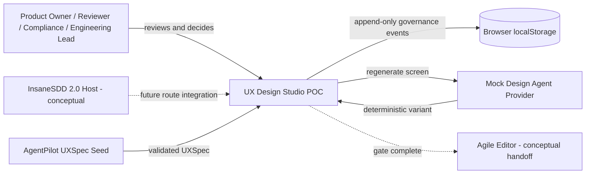
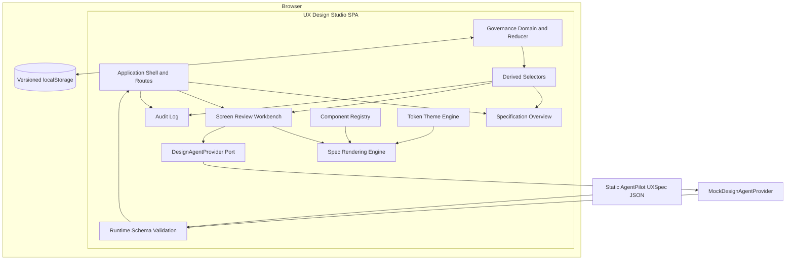
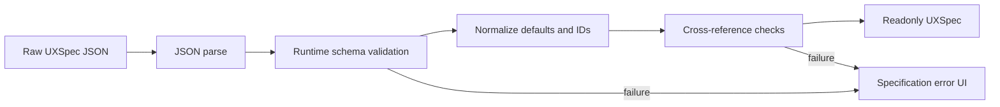
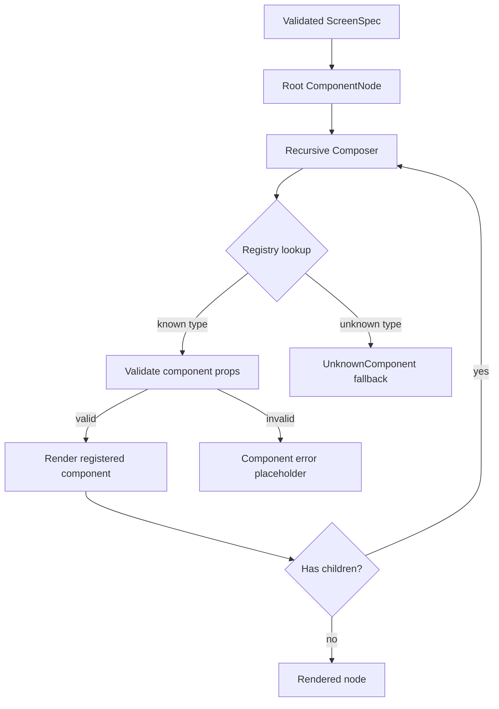
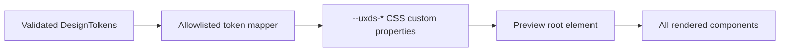
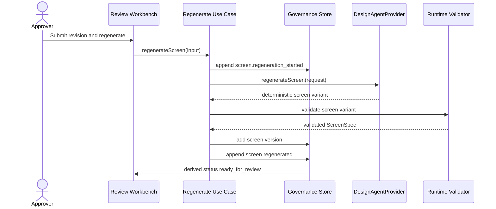
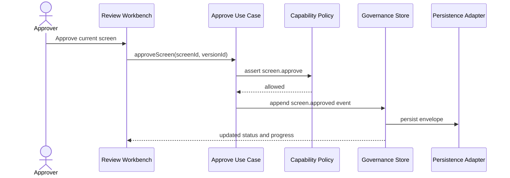
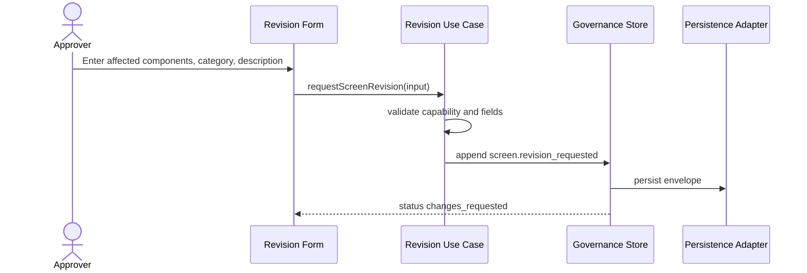
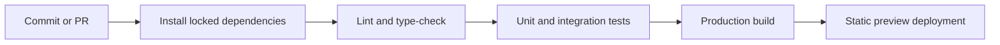
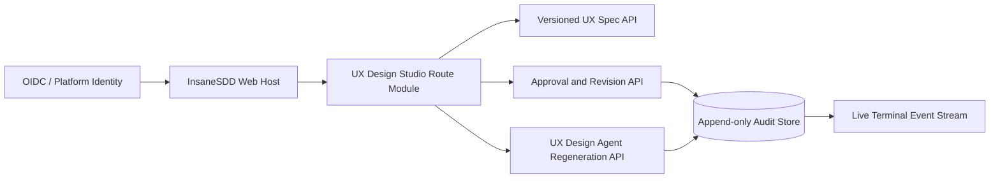

# Technical Architecture Document

## UX Design Studio: Visual Preview and Approval Workbench for InsaneSDD 2.0

> **Document type:** Technical Architecture and Solution Design  
> **Architecture version:** 1.0  
> **Source baseline:** UX Design Studio - Source of Truth v1.0, frozen  
> **Product requirements:** UX Design Studio PRD v1.0  
> **Product type:** Proof-of-work concept extension, not an official InfoBeans product  
> **Target date:** July 17, 2026  
> **Maximum total delivery effort:** 50 build hours  
> **Architecture status:** Ready for review  
> **Owner:** Mathan K A

---

## 1. Document authority and scope control

This architecture translates the frozen Source of Truth and PRD into an implementable technical design. It does not add product scope.

### Authority order

When documents conflict, use this order:

1. UX Design Studio - Source of Truth v1.0
2. UX Design Studio PRD v1.0
3. This Technical Architecture v1.0
4. Backlog tasks and implementation notes

### Hard constraints

- Total delivery remains capped at 50 build hours.
- The POC is a static frontend application.
- No production backend, real LLM call, SSO, or production RBAC is implemented.
- Browser storage is sufficient for approval, revision, regeneration, and audit state.
- The product remains a concept extension, not an official InfoBeans module.
- Scope cuts follow the frozen order:
  1. Journey walkthrough
  2. Screen-version history
  3. Full accessibility overlay, retain contrast badges
  4. Tablet breakpoint, retain mobile and desktop
- The following must never be cut:
  - Specification-driven rendering engine
  - Runtime design-token theming
  - Per-screen approval
  - Audit log
  - AgentPilot seed-data fidelity

---

## 2. Architecture executive summary

UX Design Studio will be delivered as a standalone React 18 and TypeScript single-page application with a modular, micro-frontend-ready boundary.

The application consumes a validated, immutable `UXSpec` document and renders screens through a recursive composition engine backed by an allowlisted component registry. Design tokens are mapped to namespaced CSS custom properties. Governance operations, including approval, revision, and regeneration, append immutable domain events to a versioned browser-persistence adapter. Current screen status is derived from those events rather than maintained as a second conflicting source of truth.

AI regeneration is isolated behind a `DesignAgentProvider` interface. The POC uses a deterministic mock provider and pre-authored screen variants. A production provider can later call the InsaneSDD UX Design Agent without changing the view layer or governance workflow.

The POC will not use runtime Module Federation. That would add deployment, shared-dependency, and host-version risk without delivering user value inside the 50-hour limit. Instead, the application will preserve micro-frontend compatibility through strict module boundaries, scoped styles, a host integration contract, configurable base paths, and no reliance on global application state.

### Key architecture decisions

| Area | Decision |
|---|---|
| Runtime | React 18, Vite, TypeScript strict mode |
| Application shape | Standalone SPA, architected as a route-level micro-frontend candidate |
| Domain validation | Runtime schema validation at the UXSpec boundary |
| Rendering | Recursive JSON-to-React composer with allowlisted registry |
| Styling | CSS Modules for shell and components, namespaced CSS custom properties for runtime tokens |
| State | Immutable UXSpec plus event-driven governance reducer |
| Persistence | Versioned localStorage adapter with validation and recovery |
| Navigation | Studio routes plus spec-defined preview navigation |
| AI integration | `DesignAgentProvider` port with deterministic mock adapter |
| Authorization | Capability checks for mocked Approver, Reviewer, Viewer roles |
| Testing | Vitest and React Testing Library, focused on renderer and governance reducer |
| Deployment | Static build to Vercel or Netlify |
| Production evolution | API adapters, OIDC/RBAC, append-only event store, Live Terminal events, route-level MFE integration |

---

## 3. Architecture goals

The architecture must:

- Render all five AgentPilot screens from the same typed and validated specification path.
- Prevent AI-generated JSON from executing arbitrary code, HTML, scripts, or components.
- Keep source UX specification data immutable during review.
- Keep render state separate from governance and audit state.
- Make every governance action traceable to project, specification, baseline, screen, and screen version.
- Allow the mock AI provider to be replaced without rewriting UI components.
- Allow optional cut-line features to be removed without destabilizing mandatory capabilities.
- Remain understandable to a senior engineer during a live architecture walkthrough.
- Preserve a credible future path into the InsaneSDD host as a route-level micro-frontend.

---

## 4. Architecture non-goals

This document does not design or implement:

- A general-purpose low-code page builder
- Arbitrary React component execution from JSON
- Drag-and-drop editing
- Collaborative real-time design editing
- A production backend
- Production identity, authentication, or authorization
- A production event-streaming platform
- A real UX-generation prompt pipeline
- Multi-tenant or multi-project storage
- Multi-repository integration
- Production-grade wireframe-to-code generation
- A full design system package
- Runtime Module Federation for the POC
- A production InsaneSDD deployment topology

Production interfaces are documented only to prove that the POC architecture has a viable extension path.

---

## 5. Architectural principles

### 5.1 Source specifications are immutable

The loaded `UXSpec` is treated as an immutable product contract. Approval and revision state must not modify the original specification object.

Regenerated screens produce a new screen version in a runtime version repository. They do not overwrite the frozen baseline source.

### 5.2 AI output is untrusted input

The UX specification may eventually be AI-generated. It must pass runtime schema validation before entering the renderer.

The renderer resolves only known component types. It does not evaluate JavaScript, dynamic imports, HTML strings, or arbitrary CSS supplied by the specification.

### 5.3 One rendering path

All five screens use the same composer and registry. Hard-coded page-specific React screens are not the primary architecture.

Page-specific seed data is permitted. Page-specific rendering branches are not.

### 5.4 Events create governance truth

Approval, revision, and regeneration are append-only events. Current status is derived from the event stream through selectors.

This prevents the audit log and visible approval status from drifting apart.

### 5.5 Ports isolate external systems

Browser persistence, time, ID generation, AI regeneration, and future APIs are represented as interfaces. POC adapters remain deterministic and locally testable.

### 5.6 Micro-frontend readiness without premature distribution

The module avoids global CSS, global stores, host-specific routing assumptions, and direct access to host internals. It can later be packaged behind a mount contract or Module Federation remote without forcing that complexity into the POC.

### 5.7 Scope isolation is an architecture requirement

Journey walkthrough, version-history UI, accessibility overlay, and tablet preview are isolated behind feature modules and flags. Removing them must not change the renderer, theming, approval, or audit foundations.

---

## 6. System context



### Trust boundaries

| Boundary | Trust level | Required control |
|---|---|---|
| Seed or future UXSpec API to application | Untrusted structured input | Runtime validation, allowlisted node types, bounded values |
| Browser UI to governance reducer | User-controlled interaction | Capability checks and domain validation |
| localStorage to application | Untrusted persisted data | Versioned schema validation and recovery |
| Mock or future AI provider to application | Untrusted generated output | Provider-result validation before version activation |
| Host application to micro-frontend | Trusted integration contract, untrusted values | Typed props, runtime validation, lifecycle isolation |

---

## 7. Logical container architecture



### Container responsibilities

| Container | Responsibility |
|---|---|
| Application Shell | Bootstrapping, routing, providers, error boundaries, host integration seam |
| Specification Overview | Counts, design-system summary, approval progress, screen entry points |
| Screen Review Workbench | Preview frame, lenses, governance actions, revision form, version selection |
| Audit Log | Chronological and screen-filtered event inspection |
| Rendering Engine | Recursive composition of validated component nodes |
| Component Registry | Type-to-renderer mapping and node-prop contracts |
| Token Theme Engine | Validated design-token mapping to namespaced CSS variables |
| Governance Domain | Commands, events, reducer, policies, selectors |
| Provider Port | AI regeneration boundary independent of UI and transport |
| Persistence Adapter | Serialization, migration, corruption recovery, localStorage isolation |

---

## 8. Recommended technology stack

| Concern | Choice | Reason |
|---|---|---|
| UI runtime | React 18 | Required direction, mature component and accessibility ecosystem |
| Build tool | Vite | Fast local iteration and static production output |
| Language | TypeScript strict | Domain safety, registry contracts, provider replacement safety |
| Routing | React Router | Clear overview, review, and audit routes, supports future host base path |
| Runtime schemas | Zod or an equivalent schema library | AI and persistence boundaries require runtime validation, TypeScript alone is insufficient |
| Styling | CSS Modules plus CSS custom properties | Scoped styles for MFE readiness and runtime token updates |
| Unit and integration tests | Vitest plus React Testing Library | Fast Vite-native tests and user-facing behavior validation |
| Linting | ESLint with TypeScript rules | Prevent unsafe types and React mistakes |
| Formatting | Prettier | Predictable AI-assisted and human-authored diffs |
| Deployment | Vercel or Netlify | Static hosting, previews, rollback, no backend dependency |

### Deliberately excluded from the POC stack

- Redux, Zustand, or another global state library
- Module Federation
- Server-side rendering
- Backend-as-a-service persistence
- WebSocket clients
- Production analytics SDKs

The state model is small enough for a pure reducer and Context boundary. Adding a global state library would increase setup and coupling without solving a POC problem.

---

## 9. Micro-frontend architecture decision

### Decision

Build the POC as a standalone SPA with micro-frontend-compatible boundaries. Do not implement runtime Module Federation within the 50-hour scope.

### Why not Module Federation now

- The InsaneSDD host build tool, React version, routing model, authentication contract, and deployment pipeline are unknown.
- Shared React singleton configuration can create host-remote version coupling.
- Runtime remote loading introduces failure modes unrelated to the core product hypothesis.
- The POC must demonstrate rendering and governance, not deployment distribution.
- A standalone URL is easier for interview evaluation and offline-safe demonstrations.

### MFE readiness requirements

The implementation must:

- Avoid global CSS selectors except a documented root reset scoped under the module root.
- Prefix CSS variables with `--uxds-`.
- Avoid shared `window` state.
- Accept a configurable base path.
- Keep host navigation behind callbacks or an integration adapter.
- Avoid reading host cookies, localStorage keys, or DOM outside the mount container.
- Clean up listeners and timers when unmounted.
- Keep domain and application logic independent from React mounting.

### Future host contract

The following contract is documented for production integration, not required to be consumed by the POC host:

```ts
export type UxDesignStudioRole = "approver" | "reviewer" | "viewer";

export interface UxDesignStudioHostProps {
  projectId: string;
  baselineVersion: string;
  actor: {
    id: string;
    displayName: string;
    role: UxDesignStudioRole;
  };
  basePath?: string;
  initialScreenId?: string;
  onNavigateToAgileEditor?: (context: {
    projectId: string;
    baselineVersion: string;
  }) => void;
  onGateStatusChange?: (status: "in_review" | "approved") => void;
}

export interface UxDesignStudioHandle {
  update(next: Partial<UxDesignStudioHostProps>): void;
  unmount(): void;
}

export function mountUxDesignStudio(
  container: HTMLElement,
  props: UxDesignStudioHostProps,
): UxDesignStudioHandle;
```

### Future integration options

| Option | Use when | Tradeoff |
|---|---|---|
| Route-level Module Federation remote | Host and module share compatible React and coordinated deployment contracts | Efficient integration, but shared-dependency coupling |
| Mount API in Vite library build | Host needs lifecycle control without framework assumptions | Clear isolation, slightly more integration code |
| Web Component wrapper | Host technology differs or strong style isolation is required | Framework-neutral, but React event and context bridging is more complex |
| Iframe | Strict security or release isolation dominates | Strong isolation, weakest UX and navigation integration |

**Recommended future path:** route-level remote or mount API, selected only after inspecting the actual InsaneSDD host architecture.

---

## 10. Application routes and navigation

### Studio routes

```text
/                         -> redirect to /overview
/overview                 -> specification summary and approval progress
/review/:screenId         -> active screen review workbench
/audit                     -> full audit log
```

If embedded under a host:

```text
/projects/:projectId/ux-design-studio/*
```

### Navigation responsibilities

There are two navigation layers:

- **Studio navigation:** Overview, Review, Audit.
- **Generated product navigation:** Dashboard, Tasks, Agents, Workflows, Reports, and secondary items defined by `UXSpec`.

Generated product navigation changes the active preview screen. It must not directly couple to the studio shell or host routing.

### Deep linking

The active screen ID is encoded in the studio route. Persona, breakpoint, overlay, and selected version may remain ephemeral UI state unless implementation time permits URL search parameters.

---

## 11. Source code architecture

```text
src/
  app/
    App.tsx
    routes.tsx
    providers.tsx
    error-boundary.tsx
    config.ts

  domain/
    ux-spec/
      model.ts
      schemas.ts
      invariants.ts
    governance/
      commands.ts
      events.ts
      reducer.ts
      policies.ts
      selectors.ts
    identity/
      roles.ts
      capabilities.ts

  application/
    load-ux-spec.ts
    approve-screen.ts
    request-revision.ts
    regenerate-screen.ts
    complete-gate.ts

  ports/
    design-agent-provider.ts
    governance-repository.ts
    screen-version-repository.ts
    clock.ts
    id-generator.ts

  infrastructure/
    seed/
      agentpilot.uxspec.json
      agentpilot-variants.ts
    persistence/
      local-storage-governance-repository.ts
      local-storage-migrations.ts
    providers/
      mock-design-agent-provider.ts
    platform/
      browser-clock.ts
      browser-id-generator.ts

  renderer/
    component-registry.ts
    recursive-composer.tsx
    node-boundary.tsx
    unknown-component.tsx
    render-context.ts
    token-theme.ts
    registered-components/
      stack.tsx
      grid.tsx
      panel.tsx
      text.tsx
      button.tsx
      input.tsx
      select.tsx
      navigation.tsx
      data-table.tsx
      status-badge.tsx
      feedback.tsx
      chart-placeholder.tsx

  features/
    overview/
    screen-review/
    approval/
    revision/
    audit-log/
    persona-lens/
    responsive-preview/
    accessibility-overlay/
    journey-walkthrough/
    version-history/

  ui/
    primitives/
    layout/
    dialogs/
    icons/
    styles/

  integration/
    host-contract.ts
    mount.tsx

  test/
    fixtures/
    render-with-providers.tsx
```

### Dependency rule

```text
UI and infrastructure -> application -> domain
renderer -> domain ux-spec model
application -> ports
infrastructure -> ports

domain must not import React, browser APIs, routing, localStorage, or provider implementations
```

This rule keeps the approval model and provider boundary independently testable and supports future MFE packaging.

---

## 12. Domain model

### 12.1 Core identifiers

Use branded string types where practical to avoid mixing IDs.

```ts
type Brand<T, Name extends string> = T & { readonly __brand: Name };

export type ProjectId = Brand<string, "ProjectId">;
export type SpecId = Brand<string, "SpecId">;
export type ScreenId = Brand<string, "ScreenId">;
export type ScreenVersionId = Brand<string, "ScreenVersionId">;
export type ComponentNodeId = Brand<string, "ComponentNodeId">;
export type PersonaId = Brand<string, "PersonaId">;
export type JourneyId = Brand<string, "JourneyId">;
export type AuditEventId = Brand<string, "AuditEventId">;
```

Branded types are optional if time is tight. Plain strings remain acceptable as long as interfaces stay explicit.

### 12.2 UX specification

```ts
export interface UXSpec {
  id: SpecId;
  projectId: ProjectId;
  version: string;
  baselineVersion: string;
  title: string;
  description?: string;
  personas: Persona[];
  journeys: Journey[];
  screens: ScreenSpec[];
  navigation: NavigationSpec;
  designTokens: DesignTokens;
  accessibilityRequirements: AccessibilityRequirement[];
  performanceConsiderations: string[];
}

export interface ScreenSpec {
  id: ScreenId;
  name: string;
  routeKey: string;
  description?: string;
  root: ComponentNode;
  personaTouchpoints?: PersonaTouchpoint[];
  responsive?: ResponsiveScreenSpec;
  accessibility?: AccessibilityAnnotation[];
}
```

### 12.3 Component node

The preferred model is a discriminated union for registered component categories.

```ts
export type ComponentType =
  | "stack"
  | "grid"
  | "panel"
  | "text"
  | "button"
  | "input"
  | "select"
  | "navigation"
  | "dataTable"
  | "statusBadge"
  | "feedback"
  | "chart";

export interface ComponentNode {
  id: ComponentNodeId;
  type: ComponentType | string;
  props?: Record<string, unknown>;
  children?: ComponentNode[];
  visibleWhen?: VisibilityRule;
  accessibility?: AccessibilityAnnotation[];
}
```

`type` accepts `string` at the raw boundary so unknown AI output can be represented and rendered through a safe fallback. After validation and normalization, known nodes use `ComponentType`.

### 12.4 Personas and journeys

```ts
export interface Persona {
  id: PersonaId;
  name: string;
  role: string;
  technicalProficiency?: string;
  goals: string[];
  frustrations: string[];
  devicePreferences?: string[];
}

export interface Journey {
  id: JourneyId;
  name: string;
  personaId: PersonaId;
  steps: JourneyStep[];
}

export interface JourneyStep {
  id: string;
  order: number;
  screenId: ScreenId;
  title: string;
  description: string;
  targetNodeId?: ComponentNodeId;
}
```

### 12.5 Design tokens

Use semantic tokens rather than raw arbitrary CSS keys.

```ts
export interface DesignTokens {
  color: {
    primary: string;
    primaryContrast: string;
    surface: string;
    surfaceMuted: string;
    text: string;
    textMuted: string;
    border: string;
    success: string;
    warning: string;
    danger: string;
  };
  typography: {
    fontFamily: string;
    baseSize: string;
    headingWeight: number;
    bodyWeight: number;
    lineHeight: number;
  };
  spacing: {
    xs: string;
    sm: string;
    md: string;
    lg: string;
    xl: string;
  };
  radius: {
    sm: string;
    md: string;
    lg: string;
  };
}
```

### 12.6 Governance events

```ts
export type GovernanceEvent =
  | ScreenApprovedEvent
  | RevisionRequestedEvent
  | ScreenRegenerationStartedEvent
  | ScreenRegeneratedEvent
  | ScreenRegenerationFailedEvent;

interface BaseGovernanceEvent {
  id: AuditEventId;
  projectId: ProjectId;
  specId: SpecId;
  specVersion: string;
  baselineVersion: string;
  screenId: ScreenId;
  screenVersionId: ScreenVersionId;
  actor: ActorSnapshot;
  occurredAt: string;
}

export interface ScreenApprovedEvent extends BaseGovernanceEvent {
  type: "screen.approved";
  payload: {
    comment?: string;
  };
}

export interface RevisionRequestedEvent extends BaseGovernanceEvent {
  type: "screen.revision_requested";
  payload: {
    affectedNodeIds: ComponentNodeId[];
    category: RevisionCategory;
    description: string;
  };
}

export interface ScreenRegeneratedEvent extends BaseGovernanceEvent {
  type: "screen.regenerated";
  payload: {
    previousVersionId: ScreenVersionId;
    newVersionId: ScreenVersionId;
    revisionEventId: AuditEventId;
    provider: "mock" | "production";
  };
}
```

### 12.7 Screen status

Screen status is derived, not persisted separately.

```ts
export type ScreenReviewStatus =
  | "not_reviewed"
  | "changes_requested"
  | "regenerating"
  | "ready_for_review"
  | "approved";
```

An approval applies to a specific screen version. Regeneration creates a new version whose status is `ready_for_review`. Approval of the previous version does not approve the new version.

---

## 13. Runtime validation and normalization

### Validation stages



### Required validations

- Required document metadata exists.
- Baseline and specification versions are non-empty.
- Screen IDs are unique.
- Component node IDs are unique within a screen.
- Journey screen references exist.
- Persona references exist.
- Navigation targets resolve to known screens or safe placeholders.
- Component-tree depth is bounded.
- String lengths are bounded.
- URLs use allowlisted protocols.
- Token keys are allowlisted.
- Color and length token values match safe formats.
- Provider-generated variants validate against the same screen schema.

### Failure behavior

- A document-level validation failure blocks the workbench and displays a diagnostic summary.
- An invalid screen may render a partial-data state while unaffected screens remain accessible.
- An invalid component node renders `UnknownComponent` with node ID and type, but does not crash the screen.
- Raw validation diagnostics are available in development mode. User-facing errors remain concise.

---

## 14. Spec-driven rendering engine

### 14.1 Rendering flow



### 14.2 Registry contract

```ts
export interface RegisteredComponent<P extends object = object> {
  type: ComponentType;
  validateProps(input: unknown): P;
  Component: React.ComponentType<RegisteredComponentProps<P>>;
  acceptsChildren: boolean;
}

export interface RegisteredComponentProps<P extends object> {
  nodeId: ComponentNodeId;
  props: P;
  children?: React.ReactNode;
  context: RenderContext;
}

export type ComponentRegistry = ReadonlyMap<
  ComponentType,
  RegisteredComponent
>;
```

The registry is created once at application startup and treated as immutable.

### 14.3 Recursive composer contract

```ts
export interface RecursiveComposerProps {
  node: ComponentNode;
  context: RenderContext;
  depth?: number;
}
```

The composer:

- Enforces a maximum depth guard.
- Resolves the component by node type.
- Validates props using the registered schema.
- Recursively composes children only when supported.
- Applies `key={node.id}`.
- Wraps each registered node in a local error boundary.
- Adds optional accessibility and persona annotation anchors.
- Does not execute arbitrary event-handler code from the spec.

### 14.4 Event binding

The specification may reference declarative actions, not JavaScript functions.

```ts
export type DeclarativeAction =
  | { type: "navigate"; targetScreenId: ScreenId }
  | { type: "openDialog"; dialogId: string }
  | { type: "submitDemoForm"; formId: string }
  | { type: "noop" };
```

An `ActionResolver` maps these known actions to application callbacks. Unknown actions become no-ops with development diagnostics.

### 14.5 Unknown-component strategy

Unknown types render a labeled, accessible placeholder containing:

- Component type
- Node ID
- Short explanation that the component is unsupported

This preserves the rest of the screen and proves graceful partial-data handling.

### 14.6 Registry cap

The POC registry is capped at approximately 12 to 15 types. Seed screens must be expressed through composition of these reusable primitives rather than by introducing a new renderer for every visual element.

---

## 15. Design-token theme engine

### Token flow



### Example mapping

```ts
const tokenMap = {
  "--uxds-color-primary": tokens.color.primary,
  "--uxds-color-primary-contrast": tokens.color.primaryContrast,
  "--uxds-color-surface": tokens.color.surface,
  "--uxds-color-text": tokens.color.text,
  "--uxds-space-sm": tokens.spacing.sm,
  "--uxds-space-md": tokens.spacing.md,
  "--uxds-radius-md": tokens.radius.md,
} satisfies React.CSSProperties;
```

### Safety rules

- Only predefined token fields are mapped.
- Arbitrary CSS property names are rejected.
- Values are validated before assignment.
- `url(...)`, `expression(...)`, and unsupported protocols are rejected.
- Tokens apply only to the preview root, not the full studio or host page.

### Live updates

Token editing is a demonstration control over a draft token object. It must not mutate the frozen source object. The preview derives an effective token set:

```text
frozen UXSpec tokens + local preview overrides = effective preview tokens
```

Overrides are ephemeral unless persistence is explicitly included within the existing scope.

---

## 16. State architecture

### 16.1 State categories

| Category | Examples | Storage |
|---|---|---|
| Immutable source state | Validated UXSpec, baseline version | Memory, loaded from seed |
| Persistent governance state | Audit events, active screen versions | Versioned localStorage |
| Derived domain state | Approval progress, screen status, gate status | Memoized selectors |
| Ephemeral UI state | Active persona, breakpoint, dialogs, filters | Component or feature state |
| Provider request state | Regeneration pending/error | Reducer or application use-case state |

### 16.2 Governance reducer

```ts
export interface GovernanceState {
  schemaVersion: 1;
  events: GovernanceEvent[];
  screenVersions: Record<ScreenId, ScreenVersionRecord[]>;
}

export type GovernanceAction =
  | { type: "rehydrated"; state: GovernanceState }
  | { type: "eventAppended"; event: GovernanceEvent }
  | { type: "screenVersionAdded"; version: ScreenVersionRecord }
  | { type: "storageReset" };
```

Reducer requirements:

- Pure and deterministic
- No browser API access
- No time or ID generation
- No mutation of existing arrays or objects
- Reject duplicate event IDs
- Preserve chronological append order

### 16.3 Commands and policies

UI components do not directly construct domain events. They call application commands:

```ts
approveScreen(input)
requestScreenRevision(input)
regenerateScreen(input)
```

Application commands:

1. Validate role capability.
2. Validate current screen and version.
3. Use injected clock and ID generator.
4. Create a domain event.
5. Dispatch the event.
6. Persist through the repository adapter.

### 16.4 Derived selectors

Required selectors include:

- `selectCurrentScreenVersion(screenId)`
- `selectScreenStatus(screenId, versionId)`
- `selectApprovalProgress()`
- `selectIsGateComplete()`
- `selectEventsForScreen(screenId)`
- `selectLatestRevisionRequest(screenId)`
- `selectCanApprove(actor)`
- `selectCanRegenerate(actor)`

### 16.5 Gate-completion invariant

```text
Gate is approved only when every required screen's current version has a latest effective approval event and no later revision or regeneration event invalidates it.
```

This rule must be tested directly.

---

## 17. Persistence architecture

### Storage key

```text
uxds:v1:<projectId>:<specId>:<baselineVersion>
```

### Stored envelope

```ts
export interface PersistedGovernanceEnvelope {
  schemaVersion: 1;
  savedAt: string;
  projectId: ProjectId;
  specId: SpecId;
  specVersion: string;
  baselineVersion: string;
  state: GovernanceState;
}
```

### Persistence behavior

- Persist only governance events and screen-version records required by the demo.
- Debounce writes lightly to avoid repeated serialization during quick interactions.
- Validate the stored envelope before rehydration.
- Ignore data whose project, spec, or baseline identity does not match the loaded UXSpec.
- On corrupted storage, quarantine or delete the invalid key and start with clean state.
- Expose a visible "Reset demo state" action.

### Limitations

localStorage is not secure, transactional, collaborative, or suitable for regulated audit retention. It is a POC adapter only.

---

## 18. Role and capability model

### Roles

```ts
export type DemoRole = "approver" | "reviewer" | "viewer";
```

### Capabilities

```ts
export type Capability =
  | "screen.view"
  | "audit.view"
  | "screen.approve"
  | "screen.requestRevision"
  | "screen.regenerate";
```

| Capability | Approver | Reviewer | Viewer |
|---|---:|---:|---:|
| View screens | Yes | Yes | Yes |
| View audit log | Yes | Yes | Yes |
| Approve screen | Yes | No | No |
| Request revision | Yes | No | No |
| Regenerate screen | Yes | No | No |

### Enforcement

- Product composition injects Demo Approver as the fixed actor.
- No role-switching or active-actor UI is rendered.
- Application commands re-check capability before creating events.
- Reviewer and Viewer fixtures remain internal to authorization tests.
- No security claim is made for the synthetic Demo Approver identity.

---

## 19. AI provider architecture

### 19.1 Provider port

```ts
export interface RegenerateScreenRequest {
  projectId: ProjectId;
  specId: SpecId;
  specVersion: string;
  baselineVersion: string;
  screen: Readonly<ScreenSpec>;
  currentVersionId: ScreenVersionId;
  revision: {
    affectedNodeIds: ComponentNodeId[];
    category: RevisionCategory;
    description: string;
  };
  personaContext?: Readonly<Persona>;
}

export interface RegenerateScreenResult {
  providerRequestId: string;
  generatedAt: string;
  screen: ScreenSpec;
  explanation?: string[];
}

export interface DesignAgentProvider {
  regenerateScreen(
    request: RegenerateScreenRequest,
    signal?: AbortSignal,
  ): Promise<RegenerateScreenResult>;
}
```

### 19.2 Mock provider

The mock adapter:

- Uses deterministic pre-authored variants keyed by screen ID and revision category.
- Adds simulated latency.
- Supports cancellation through `AbortSignal`.
- Can simulate one controlled error path.
- Returns data that passes the same runtime schema as source screens.
- Never calls an external API.

### 19.3 Regeneration sequence



### 19.4 AI safety controls

- Never render model-generated HTML.
- Never execute model-generated JavaScript.
- Never permit the model to select arbitrary imports.
- Validate all result IDs and cross-references.
- Constrain component types to the registry allowlist.
- Preserve the revision request and provider request ID for traceability.
- Log provider errors without exposing secrets or stack traces to the user.

### 19.5 Production adapter path

A production adapter may later call:

```text
POST /projects/:projectId/ux-spec/screens/:screenId/regenerate
```

The API response must return a versioned, validated `ScreenSpec` and provider metadata. The application architecture remains unchanged because the provider port is transport-agnostic.

---

## 20. Approval and revision sequences

### Screen approval



### Revision request



---

## 21. Responsive preview architecture

The responsive preview simulates device width inside the workbench. It does not resize the browser or use an iframe.

```ts
export type PreviewBreakpoint = "mobile" | "tablet" | "desktop";

const previewWidths: Record<PreviewBreakpoint, number> = {
  mobile: 390,
  tablet: 768,
  desktop: 1280,
};
```

### Implementation rules

- Apply width to a preview viewport container.
- Use container queries where supported by the selected CSS approach, otherwise use a breakpoint data attribute on the preview root.
- Registered components read layout behavior from `RenderContext.breakpoint` and responsive node props.
- Screen recomposition happens without reloading the route.
- Mobile and desktop remain mandatory.
- Tablet is isolated and removable by deleting one option and related seed rules.

---

## 22. Persona lens architecture

Persona context is a review annotation layer, not a mutation of the rendered screen.

```ts
export interface PersonaLensState {
  activePersonaId?: PersonaId;
  showAnnotations: boolean;
}
```

### Behavior

- Select a persona from the three seeded personas.
- Resolve touchpoints for the active screen and optional component nodes.
- Render annotations in a separate overlay or side panel.
- Preserve pointer and keyboard access to the underlying preview.
- Do not insert persona commentary into component props.

This separation allows the feature to be removed without affecting the renderer.

---

## 23. Accessibility overlay architecture

The accessibility overlay reads metadata already attached to screen or component nodes.

### Annotation types

```ts
export type AccessibilityAnnotation =
  | { type: "contrast"; status: "pass" | "warning"; ratio?: number }
  | { type: "aria"; role?: string; label?: string }
  | { type: "screenReader"; note: string }
  | { type: "keyboard"; note: string };
```

### Rendering rules

- Annotations remain visually distinct from the product preview.
- Annotation markers are keyboard reachable.
- Marker details use accessible popovers or a side panel.
- Overlay state never changes the underlying UXSpec.
- When the full overlay is cut, retain contrast badges through a minimal node decorator.

### Studio accessibility requirements

- Visible focus indicators
- Logical heading hierarchy
- Keyboard-accessible route and screen navigation
- Dialog focus trap and focus restoration
- Accessible names for breakpoint, persona, overlay, and role controls
- Live-region announcement for regeneration completion and gate completion
- Respect for reduced-motion preferences

---

## 24. Error, loading, empty, and partial-data strategy

| Condition | User behavior | Technical behavior |
|---|---|---|
| UXSpec loading | Show shell skeleton | Await validated loader result |
| Invalid UXSpec document | Show blocking specification error | Do not mount renderer |
| One invalid screen | Show screen-level error, allow other screens | Isolate validation result by screen where possible |
| Unknown component type | Show labeled placeholder | Continue sibling rendering |
| Invalid component props | Show component error placeholder | Capture diagnostic in development mode |
| Empty audit log | Show empty-state explanation | Selector returns empty array |
| localStorage unavailable | Continue in-memory with warning | Persistence adapter degrades gracefully |
| Corrupted stored state | Offer reset and start clean | Reject invalid envelope |
| Regeneration pending | Disable repeated action, show progress | Track request ID and AbortController |
| Regeneration failure | Keep current version, allow retry | Append failure event or local error state |
| Gate incomplete | Show remaining-screen count | Derived selector remains false |

### Error boundaries

- Application-level boundary for route failures
- Workbench boundary for renderer failures
- Node-level boundary around registered components

A node failure must not blank the full page.

---

## 25. Performance architecture

The seed data is small, but the architecture should demonstrate sensible scaling.

### Performance controls

- Validate and normalize UXSpec once at load time.
- Create the registry once.
- Memoize effective tokens and derived governance selectors.
- Render only the active screen.
- Lazy-load feature routes such as Audit.
- Lazy-load optional feature modules where practical.
- Use stable node IDs as React keys.
- Wrap registered leaf components in `React.memo` only after profiling confirms benefit.
- Debounce token-editor and audit-filter inputs.
- Avoid deep cloning UXSpec during UI interactions.
- Use immutable structural updates only for governance state.

### Complexity

The recursive composer is approximately `O(n)` for the active screen, where `n` is the number of component nodes. Registry lookup is `O(1)` through a map.

### Scaling to 100 screens

The architecture scales by:

- Loading screen definitions by ID rather than rendering all screens.
- Splitting large UXSpec documents into a manifest and per-screen payloads in production.
- Caching validated screen versions.
- Virtualizing only long audit lists or data tables when evidence shows a need.
- Keeping approval selectors indexed by screen ID.

The POC does not implement remote chunk loading or virtualization unless the seed data justifies it.

---

## 26. Security and privacy architecture

### POC threat model

| Threat | Control |
|---|---|
| Malicious component type in AI output | Allowlisted registry and unknown fallback |
| Script or HTML injection | No `eval`, no dynamic code, no `dangerouslySetInnerHTML` |
| Unsafe links | URL protocol allowlist and normalized targets |
| CSS injection through tokens | Allowlisted token fields and validated values |
| Corrupted localStorage | Runtime validation and reset path |
| False authorization expectation | Clear demo-role labeling and command-level capability checks |
| Secret leakage | No production credentials or customer data |
| Cross-host style leakage | CSS Modules and `--uxds-*` variable namespace |
| Stale approvals after regeneration | Approval bound to screen version, new version requires reapproval |

### Production requirements, documented only

- OIDC or platform SSO
- Server-enforced RBAC
- CSRF protection where cookie authentication is used
- Signed or integrity-protected audit events
- Append-only durable event storage
- Tenant and project authorization at every API boundary
- Retention and legal-hold policies
- Secret management
- Content Security Policy
- Observability with sensitive-data redaction

---

## 27. Testing strategy

### 27.1 Mandatory unit tests

#### Rendering engine

- Renders a known component node.
- Recursively renders nested children.
- Uses stable node IDs.
- Renders unknown type fallback without crashing.
- Renders invalid-prop placeholder.
- Enforces depth guard.
- Resolves declarative navigation action.

#### Governance reducer and selectors

- Appends events immutably.
- Rejects duplicate event IDs.
- Approves only the selected screen version.
- Leaves other screen statuses unchanged.
- Revision after approval invalidates the effective approval.
- Regeneration creates a new current version.
- Previous-version approval does not approve the regenerated version.
- Gate completes only when current versions of all required screens are approved.
- Screen-filtered audit events are chronological.

### 27.2 Integration tests

Use React Testing Library for the critical workflow:

- Load overview and open a screen.
- Switch breakpoint and persona.
- Approve a screen and observe progress.
- Submit a revision request.
- Trigger mock regeneration and observe loading plus revised screen.
- Reload the application with persisted state and verify audit history.
- Switch to Reviewer and verify governance actions are unavailable.

### 27.3 Contract tests

- AgentPilot seed data validates successfully.
- Every registered component has a prop schema.
- Every seeded known component type exists in the registry.
- Mock provider output validates against the screen schema.
- Persisted envelopes round-trip through serialize, parse, and validate.

### 27.4 Accessibility checks

- Keyboard navigation through the primary demo path
- Dialog focus management
- Accessible control names
- Live-region announcements
- Automated accessibility checks may be added within existing test time, but manual verification remains required.

### 27.5 Test boundaries

Do not spend the 50-hour budget pursuing broad snapshot coverage or pixel-level visual regression. Test domain invariants, renderer safety, and the critical governance flow.

---

## 28. Build, CI, and deployment architecture

### Local commands

```text
pnpm dev
pnpm lint
pnpm test
pnpm build
pnpm preview
```

The package manager may be npm or pnpm. Use one lockfile and document the choice.

### Minimal CI pipeline



### Deployment

- Static assets deploy to Vercel or Netlify.
- SPA rewrites route unknown paths to `index.html`.
- No secrets are required.
- Build output is reproducible from the repository.
- Preview deployment is suitable for interview access.
- The README includes the deployed URL and reset-demo-state instructions.

### Environment configuration

```ts
export interface AppConfig {
  basePath: string;
  persistenceEnabled: boolean;
  mockLatencyMs: number;
  enableJourneyWalkthrough: boolean;
  enableVersionHistory: boolean;
  enableAccessibilityOverlay: boolean;
  enableTabletPreview: boolean;
}
```

Feature flags correspond directly to the cut-line, making reductions explicit and low-risk.

---

## 29. Production integration architecture, not implemented

### Conceptual production topology



### Proposed production APIs

```http
GET  /projects/:projectId/ux-spec?version=:specVersion
POST /projects/:projectId/ux-spec/screens/:screenId/approvals
POST /projects/:projectId/ux-spec/screens/:screenId/revision-requests
POST /projects/:projectId/ux-spec/screens/:screenId/regenerations
GET  /projects/:projectId/ux-spec/audit-events
```

### Example approval request

```json
{
  "specId": "spec_agentpilot",
  "specVersion": "1",
  "baselineVersion": "1",
  "screenId": "screen_dashboard",
  "screenVersionId": "screen_dashboard_v1",
  "comment": "Approved for Agile plan generation"
}
```

### Concurrency and integrity

Production writes should use an expected version or idempotency key to prevent duplicate or stale approvals.

```http
Idempotency-Key: <uuid>
If-Match: <screen-version-etag>
```

The server remains the authority for identity, permissions, event ordering, and gate completion.

---

## 30. Observability and audit design

### POC

- Append-only in-app audit log
- Development diagnostics through structured console logging
- No external telemetry dependency
- No production user data

### Production path

Recommended event metadata:

```ts
interface ProductionAuditMetadata {
  correlationId: string;
  causationId?: string;
  actorId: string;
  tenantId: string;
  projectId: string;
  specId: string;
  baselineVersion: string;
  screenId: string;
  screenVersionId: string;
  source: "ux-design-studio";
}
```

The event stream may publish gate and regeneration events to InsaneSDD's Live Terminal. This is documented only and not part of the POC.

---

## 31. Requirement-to-architecture traceability

| PRD requirements | Architecture modules |
|---|---|
| FR-001 to FR-004 | Overview feature, routes, governance selectors |
| FR-010 to FR-015 | UXSpec schemas, registry, recursive composer, node error boundaries |
| FR-020 to FR-023 | Token theme engine, CSS custom properties, preview root |
| FR-030 to FR-034 | Generated navigation adapter, routes, optional journey feature |
| FR-040 to FR-042 | Persona lens feature and annotation layer |
| FR-050 to FR-053 | Responsive preview context and feature flag |
| FR-060 to FR-062 | Accessibility annotation feature and contrast decorator |
| FR-070 to FR-075 | Governance commands, events, reducer, selectors, gate policy |
| FR-080 to FR-083 | Revision feature, validation, revision event |
| FR-090 to FR-095 | DesignAgentProvider port, mock adapter, screen-version repository |
| FR-100 to FR-105 | Event stream, audit selectors, persistence adapter, audit route |
| FR-110 to FR-112 | Role capability policy and role-switcher feature |

### Traceability convention

```text
Source of Truth capability
  -> PRD requirement ID
    -> architecture module
      -> backlog task
        -> commit or pull request
          -> test evidence
```

Example:

```text
Per-screen approval
  -> FR-070 / US-4.1
    -> domain/governance + application/approve-screen
      -> TASK-GOV-APPROVE
        -> feat(governance): implement version-bound approval
          -> governance.reducer.test.ts
```

---

## 32. Cut-line isolation design

| Cut item | Isolation mechanism | Core impact when removed |
|---|---|---|
| Journey walkthrough | Independent feature module and flag | None |
| Screen-version history UI | Independent selector and panel, version records can still support current variant | None to current screen regeneration |
| Full accessibility overlay | Independent overlay feature, contrast decorator retained | None |
| Tablet breakpoint | Config option and one preview width | None to mobile or desktop |

### Hard rule

Do not implement optional features inside the recursive composer or governance reducer unless the core domain requires the data. Optional UI must wrap or observe the core, not own it.

---

## 33. Architecture risks and mitigations

| Risk | Technical impact | Mitigation |
|---|---|---|
| UXSpec schema becomes too broad | Renderer and seed authoring exceed schedule | Keep 12 to 15 component types, use composition, reject arbitrary props |
| Hard-coded screens bypass the engine | POC fails its core architecture claim | Contract test that every seeded screen uses registered nodes |
| UI and audit status diverge | Traceability becomes unreliable | Derive status from append-only events |
| localStorage corruption breaks demo | Demo cannot start | Versioned envelope, validation, reset path, in-memory fallback |
| Mock AI becomes a second product | Core work slips | Deterministic variants and fixed latency only |
| Runtime theming leaks into host | MFE integration becomes unsafe | Scope variables under preview root and prefix `--uxds-` |
| Approval survives regeneration incorrectly | Governance semantics are wrong | Bind approval to screen-version ID and test invalidation |
| Optional features entangle core | Cut-line cannot be applied safely | Feature flags and dependency direction rules |
| Unknown host architecture | Premature MFE choice creates rework | Standalone POC plus documented mount contract |
| AI-generated malicious values | Injection or broken UI | Runtime schemas, allowlists, no executable content |

---

## 34. Architecture Decision Records

### ADR-001: Standalone SPA with MFE-ready boundary

**Decision:** Build a standalone SPA. Document and optionally expose a mount contract. Do not add Module Federation.

**Reason:** Delivers the product hypothesis within the schedule and avoids unknown host coupling.

**Consequence:** Production integration requires a later packaging decision after host inspection.

### ADR-002: Spec-driven renderer with allowlisted registry

**Decision:** Render all screens through a recursive composer and fixed registry.

**Reason:** Demonstrates the required architecture and safely handles AI-generated structure.

**Consequence:** Unsupported node types render placeholders until registered.

### ADR-003: Runtime schema validation

**Decision:** Validate UXSpec, provider output, and persisted state at runtime.

**Reason:** TypeScript does not validate JSON or localStorage data.

**Consequence:** Adds a small schema dependency and explicit failure states.

### ADR-004: Immutable source plus event-driven governance

**Decision:** Keep UXSpec immutable and append governance events. Derive approval status through selectors.

**Reason:** Prevents audit and UI state divergence and preserves baseline traceability.

**Consequence:** Selectors are more important than a simple mutable status map.

### ADR-005: Pure reducer with Context wiring

**Decision:** Use a pure governance reducer and React Context rather than a third-party global store.

**Reason:** Fits the POC scale, meets test requirements, and minimizes dependencies.

**Consequence:** Production may replace the wiring, but domain events and selectors remain reusable.

### ADR-006: localStorage behind a repository port

**Decision:** Use localStorage only through a versioned persistence adapter.

**Reason:** Meets POC persistence needs without coupling domain logic to browser APIs.

**Consequence:** Persistence is single-browser and non-secure by design.

### ADR-007: AI provider port with deterministic mock

**Decision:** Isolate regeneration behind `DesignAgentProvider` and ship only a mock adapter.

**Reason:** Proves replaceability without external service risk.

**Consequence:** AI quality is not evaluated by the POC.

### ADR-008: CSS Modules plus namespaced token variables

**Decision:** Scope shell and component styles, and apply design tokens as `--uxds-*` custom properties.

**Reason:** Supports runtime theming and future host isolation.

**Consequence:** Token mapping must remain allowlisted and semantic.

---

## 35. AI-led engineering guardrails

The implementation may use AI coding agents, but the frozen documents and architecture are controlling inputs.

### Agent instructions

- Read the Source of Truth, PRD requirement IDs, and relevant architecture section before editing.
- Do not add product features outside the approved scope.
- Do not replace the recursive renderer with hard-coded pages.
- Do not mutate UXSpec to store approval state.
- Do not add real AI, backend, auth, or Module Federation.
- Generate code only for one backlog task at a time.
- Reference requirement and task IDs in commits.
- Run the narrowest relevant tests before broader checks.
- Stop after repeated failures rather than silently weakening requirements.

### Review gates

AI-authored changes require human verification for:

- Domain invariants
- Runtime schemas
- Registry additions
- Event semantics
- Permission checks
- Persistence migrations
- Accessibility behavior
- Scope and cut-line compliance

---

## 36. Implementation sequence

This section describes dependency order, not a new sprint plan.

### Architecture foundation

- Project shell, strict TypeScript, lint, tests
- Domain interfaces and runtime schemas
- AgentPilot seed loader and validation
- Application routes and error boundaries

### Rendering foundation

- Component registry
- Recursive composer
- Core registered components
- Token theme engine
- Five screen seed definitions
- Generated navigation

### Governance foundation

- Governance events and reducer
- Selectors and gate policy
- localStorage adapter
- Approval action
- Revision request
- Audit log

### Provider and review capabilities

- Mock provider
- Regeneration use case
- Persona lens
- Mobile and desktop preview
- Optional cut-line features

### Release hardening

- Renderer and reducer tests
- Keyboard and focus verification
- Error and empty states
- README and ADRs
- Static deployment
- Demo-state reset and rehearsal

---

## 37. Architecture exit criteria

Architecture is approved for backlog refinement when all statements below are true:

- Every mandatory PRD requirement maps to an architecture module.
- The five screens can be represented through the registry without hard-coded page architecture.
- UXSpec, provider results, and persistence have runtime validation boundaries.
- Approval state cannot mutate the frozen specification.
- Approval applies to a specific screen version.
- Gate completion is derived from current screen-version approvals.
- Audit events have a stable append-only contract.
- Mock AI can be replaced through the provider port.
- localStorage can fail without making the application unusable.
- Role capabilities are enforced in both UI and application commands.
- Optional cut-line features are isolated behind modules and flags.
- The POC remains a standalone static deployment.
- Runtime Module Federation, backend, real LLM, and production auth remain excluded.
- Mandatory work remains feasible within the approved allocation.

---

## 38. Definition of Done for architecture implementation

- [ ] TypeScript strict mode passes.
- [ ] AgentPilot UXSpec validates at application startup.
- [ ] Five screens render through one recursive composer.
- [ ] Registry remains within the agreed component-type cap.
- [ ] Unknown components and invalid props fail gracefully.
- [ ] Runtime design tokens apply across all screens.
- [ ] Mobile and desktop preview modes work.
- [ ] Per-screen and per-version approval works.
- [ ] Structured revision requests append events.
- [ ] Mock regeneration returns a validated variant.
- [ ] Audit events persist across reloads.
- [ ] Gate completion is correct for current versions.
- [ ] Approver-only actions are command-level protected.
- [ ] Core keyboard and focus behavior is verified.
- [ ] Renderer and governance tests pass.
- [ ] Static production build succeeds.
- [ ] README states scope, exclusions, positioning, and reset instructions.
- [ ] ADR decisions are committed.
- [ ] Final implementation remains within the hard 50-hour cap.

---

## 39. Final architecture recommendation

Use a modular standalone React SPA with a validated JSON rendering boundary, an allowlisted recursive component registry, semantic runtime tokens, and event-driven governance state.

Do not implement a distributed micro-frontend runtime for the POC. Preserve the correct seams so the module can later become a route-level remote or mounted application after the actual InsaneSDD host architecture is known.

The highest-risk technical proof is the rendering engine. The highest-value product proof is version-bound per-screen approval with an append-only audit trail. Build and verify those before optional review lenses.

```text
Frozen UXSpec
  -> runtime validation
    -> recursive renderer and token theme
      -> visual screen review
        -> append-only approval and revision events
          -> mocked provider regeneration
            -> current-version approval gate
              -> ready for Agile plan generation
```

---

## Appendix A: Architecture review checklist

### Scope

- [ ] No requirement expands the frozen Source of Truth.
- [ ] No backend, real LLM, SSO, or Module Federation is introduced.
- [ ] Cut-line features are removable independently.

### Domain

- [ ] UXSpec remains immutable.
- [ ] IDs and version references are explicit.
- [ ] Current status is derived from events.
- [ ] New screen versions require new approval.

### Rendering

- [ ] All screens use one rendering path.
- [ ] Registry types are allowlisted.
- [ ] Unknown nodes do not crash the page.
- [ ] Tokens are semantic, validated, and scoped.

### Integration

- [ ] Provider is transport-independent.
- [ ] Persistence is behind a port.
- [ ] Host integration is documented without coupling the POC.

### Quality

- [ ] Critical domain invariants have tests.
- [ ] Primary user flow is keyboard accessible.
- [ ] Build and deployment are reproducible.
- [ ] Demo can run without external services.

---

## Appendix B: Source references

This architecture is derived from:

- `UX Design Studio - Source of Truth v1.0`, frozen
- `UX Design Studio PRD v1.0`

The Source of Truth remains authoritative for scope, mandatory capabilities, effort limit, and cut-line order.
